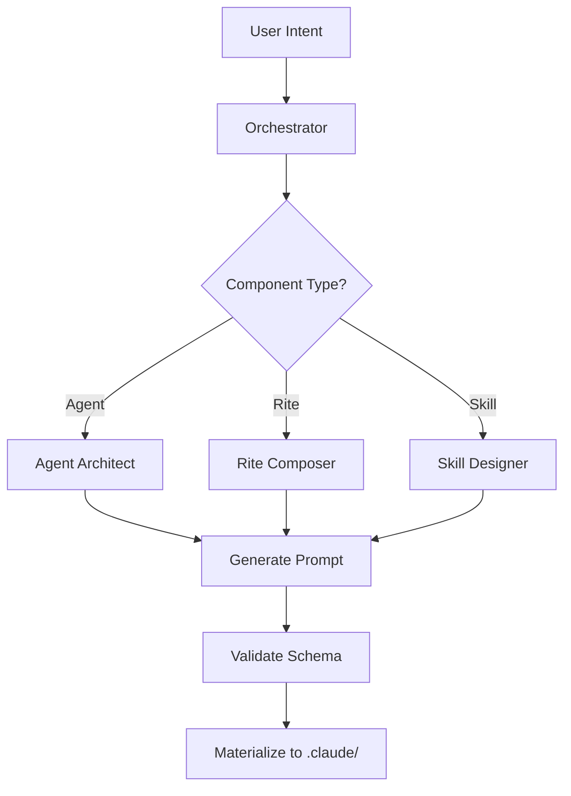

# Information Architecture: Doctrine Gap Remediation
**Date**: 2026-01-08
**Architect**: Information Architect
**Sprint**: Doctrine Documentation Gap Remediation (Sprint 2)
**Status**: APPROVED

---

## Executive Summary

This architecture addresses the 88% documentation gap for the Knossos platform by establishing a user-centered taxonomy for CLI reference (68 commands), rite catalog (12 rites), and worktree operations guide. The design prioritizes **findability in under 30 seconds** for engineers returning after 6+ months by organizing content around mental models (operational tasks) rather than implementation structure.

**Key decisions**:
1. CLI Reference organized by family, not alphabetically
2. Rite Catalog structured for discovery, not browsing
3. Worktree as operational guide, not reference material
4. Strategic symlinks for dual-context access
5. Moderate cross-referencing with GLOSSARY.md integration

---

## Audit Analysis

### Current State
```
docs/doctrine/
├── DOCTRINE.md                 # Entry point (strong)
├── philosophy/                 # Complete (95%+)
├── foundations/                # Symlinks to ADRs (good)
├── compliance/                 # Active, well-structured
├── operations/
│   ├── guides/                 # Symlinks to ../../../guides/ (good)
│   └── cli-reference/          # PLACEHOLDER (0% coverage)
│       └── README.md
├── rites/                      # PLACEHOLDER (0% coverage)
│   └── README.md
└── reference/
    ├── INDEX.md                # Navigation hub (strong)
    └── GLOSSARY.md             # Complete terminology (strong)
```

### Gap Summary
| Category | Coverage | Gap |
|----------|----------|-----|
| CLI Commands | 8/68 (12%) | 60 commands |
| Rite Catalog | 0/12 (0%) | 12 rites |
| Worktree Guide | 0/1 (0%) | 1 comprehensive guide |

### User Journey Analysis

**Primary personas**:
1. **Future Self** (6+ months later): "How do I create a session again?"
2. **New Contributor**: "What rites are available and when do I use them?"
3. **Power User**: "What are all the worktree commands and their automation patterns?"

**Mental models identified**:
- CLI users think in **families** (session, rite, worktree), not alphabetically
- Rite discovery needs **when to use** more than **how it works**
- Worktree needs **production patterns**, not just command reference

---

## Target Architecture

### Directory Structure

```
docs/doctrine/
├── DOCTRINE.md                 # Entry point (no changes)
│
├── philosophy/                 # No changes
├── foundations/                # No changes
├── compliance/                 # No changes
│
├── operations/                 # Operational "how-to" documentation
│   ├── guides/                 # Symlinks to ../../../guides/
│   │   ├── ariadne-cli.md      # Overview and quick start
│   │   ├── knossos-integration.md
│   │   ├── parallel-sessions.md
│   │   ├── user-preferences.md
│   │   └── white-sails.md
│   │
│   ├── cli-reference/          # Command documentation (man-page style)
│   │   ├── README.md           # [UPDATE] CLI families overview, navigation
│   │   ├── cli-session.md      # NEW: session family (11 commands) [HIGH]
│   │   ├── cli-rite.md         # NEW: rite family (10 commands) [HIGH]
│   │   ├── cli-worktree.md     # NEW: worktree family (10 commands) [HIGH]
│   │   ├── cli-sync.md         # NEW: sync family (8 commands) [HIGH]
│   │   ├── cli-hook.md         # NEW: hook family (6 commands) [MEDIUM]
│   │   ├── cli-handoff.md      # NEW: handoff family (4 commands) [MEDIUM]
│   │   ├── cli-inscription.md  # NEW: inscription family (5 commands) [MEDIUM]
│   │   ├── cli-artifact.md     # NEW: artifact family (4 commands) [MEDIUM]
│   │   ├── cli-validate.md     # NEW: validate family (3 commands) [MEDIUM]
│   │   ├── cli-manifest.md     # NEW: manifest family (4 commands) [MEDIUM]
│   │   ├── cli-sails.md        # NEW: sails family (1 command) [LOW]
│   │   ├── cli-naxos.md        # NEW: naxos family (1 command) [LOW]
│   │   ├── cli-tribute.md      # NEW: tribute family (1 command) [LOW]
│   │   ├── cli-completion.md   # NEW: completion family (4 commands) [LOW]
│   │   └── cli-version.md      # NEW: version command [LOW]
│   │
│   └── worktree-guide.md       # NEW: Production worktree patterns (comprehensive)
│
├── rites/                      # Rite catalog (discovery-focused)
│   ├── README.md               # [UPDATE] Catalog overview, when-to-use matrix
│   ├── 10x-dev.md              # NEW: Full development lifecycle
│   ├── debt-triage.md          # NEW: Technical debt remediation
│   ├── docs.md                 # NEW: Documentation workflow
│   ├── ecosystem.md            # NEW: Platform infrastructure
│   ├── forge.md                # NEW: Agent/tool creation (with diagrams)
│   ├── hygiene.md              # NEW: Code quality maintenance
│   ├── intelligence.md         # NEW: Research and synthesis
│   ├── rnd.md                  # NEW: Exploration and prototypes
│   ├── security.md             # NEW: Threat modeling
│   ├── sre.md                  # NEW: Operations and reliability
│   └── strategy.md             # NEW: Business analysis
│
└── reference/                  # No structural changes
    ├── INDEX.md                # [UPDATE] Add CLI and rite navigation
    └── GLOSSARY.md             # [UPDATE] Add new commands and rites
```

### Dual-Context Symlinks

Create symlinks for documentation accessible from both philosophical and operational contexts:

```bash
# Worktree accessible from both operations and guides
ln -s ../operations/worktree-guide.md docs/guides/worktree-operations.md

# Rite catalog accessible from reference (mythology context)
ln -s ../rites/ docs/doctrine/reference/rites
```

**Rationale**:
- `operations/worktree-guide.md` is canonical (technical operations context)
- `guides/worktree-operations.md` symlink provides alternative entry point for users thinking about parallel session patterns
- `reference/rites/` symlink allows philosophical browsing from INDEX.md

---

## Content Specifications

### 1. CLI Reference (15 families, 68 commands)

**File naming**: `cli-{family}.md` (e.g., `cli-session.md`)
**Location**: `docs/doctrine/operations/cli-reference/`
**Format**: Man-page style (Synopsis-Description-Flags-Examples)

#### Template Structure

```markdown
# CLI Reference: {family}

> {One-line description}

## Commands Overview

| Command | Description |
|---------|-------------|
| `ari {family} {cmd}` | Brief description |

## Commands

### `ari {family} {command}`

**Synopsis**: `ari {family} {command} [flags] [args]`

**Description**: {2-3 sentence description of what it does and when to use it}

**Flags**:
- `--flag-name` - Description
- `-f, --other` - Description

**Examples**:
```bash
# Common use case
ari {family} {command} --flag value

# Another scenario
ari {family} {command} arg1 arg2
```

**See Also**:
- Related command links
- GLOSSARY.md term links
- Guide links
```

#### Priority Ordering

| Priority | Families | Rationale |
|----------|----------|-----------|
| **HIGH** | session, rite, worktree, sync | Core workflows, used daily |
| **MEDIUM** | hook, handoff, inscription, artifact, validate, manifest | Supporting operations, periodic use |
| **LOW** | sails, naxos, tribute, completion, version | Utility commands, infrequent use |

#### Content Source Strategy

1. Extract from `ari {family} --help` and `ari {family} {command} --help`
2. Supplement with examples from existing guides
3. Add cross-references to GLOSSARY.md on first term use
4. Link to related guides (e.g., `cli-session.md` → `guides/knossos-integration.md`)

---

### 2. Rite Catalog (12 rites)

**File naming**: `{rite-name}.md` (e.g., `10x-dev.md`)
**Location**: `docs/doctrine/rites/`
**Format**: Discovery-focused (when-to-use, agents, workflow)

#### Template Structure

```markdown
# Rite: {Rite Name}

> {One-sentence purpose from manifest.yaml}

## When to Use This Rite

**Triggers**:
- {User intent pattern 1}
- {User intent pattern 2}
- {User intent pattern 3}

**Not for**: {Anti-patterns or exclusions}

## Quick Start

```bash
/task {example invocation}
# or
/rite {rite-name}
```

## Agents

| Agent | Role | Produces |
|-------|------|----------|
| {agent-name} | {role from manifest} | {artifact type} |

**Agent files**: See `.claude/agents/{agent}.md` (materialized from `/roster/rites/{rite}/agents/`)

## Workflow

{Brief description of phase flow}

**Complexity levels**: {If defined in manifest}
- {LEVEL}: {Scope}

**Phase conditions**: {If any, e.g., "design phase skipped at SCRIPT complexity"}

## Skills Reference

{List skills from manifest.yaml - no excerpts, just names with 1-line descriptions}

## Related Rites

- **{rite-name}**: {When to transition to this rite}

## See Also

- [Rite manifest](../../rites/{rite-name}/manifest.yaml)
- [Workflow specification](../../rites/{rite-name}/workflow.yaml)
- [GLOSSARY: Rite](../reference/GLOSSARY.md#rite)
```

#### Special Case: Forge Rite

**forge.md** receives enhanced treatment per requirements:
- Architecture diagrams showing agent composition flow
- Mermaid diagrams for rite creation workflow
- CI/CD integration patterns for platform development

**Example Mermaid diagram**:


#### Content Source Strategy

1. Extract metadata from `/roster/rites/{rite}/manifest.yaml`
2. Copy "When to Use" section from `/roster/rites/{rite}/README.md`
3. Reference agent files only (no prompt excerpts to avoid drift)
4. Link to workflow.yaml for detailed phase specifications
5. Maintain **discovery focus** (when/why) over implementation details (how)

---

### 3. Worktree Operations Guide

**File name**: `worktree-guide.md`
**Location**: `docs/doctrine/operations/`
**Symlink**: `docs/guides/worktree-operations.md` → `../doctrine/operations/worktree-guide.md`
**Format**: Comprehensive operational guide (not reference)

#### Structure

```markdown
# Worktree Operations Guide

> Production patterns for parallel Claude sessions with git worktrees

## Overview

{Why worktrees matter, when to use them}

## Quick Start

{30-second "get started" flow}

## Core Concepts

### Filesystem Isolation

{Explanation of independent .claude/ directories}

### Rite Independence

{How each worktree can run different rites simultaneously}

### Session Seeding

{Reference ADR-0010 for technical details}

## Command Reference

{Quick reference table - detailed commands in cli-worktree.md}

| Command | Purpose |
|---------|---------|
| `ari worktree create` | Create isolated worktree |
| `ari worktree list` | Show all worktrees |

**Full reference**: [CLI Reference: worktree](cli-reference/cli-worktree.md)

## Production Patterns

### Pattern 1: Parallel Feature Development

{Scenario, setup, workflow, cleanup}

### Pattern 2: Hotfix While Feature in Progress

{Scenario, setup, workflow, cleanup}

### Pattern 3: CI/CD Integration

{How to use worktrees in automated testing}

## Troubleshooting

### Stale Worktrees

{Detection, cleanup, prevention}

### Git State Conflicts

{Common issues and resolution}

### Session Recovery

{Recovering sessions in worktrees}

## Automation Examples

```bash
# Script for standardized worktree creation
create-feature-worktree() {
  local feature=$1
  ari worktree create "$feature" --rite=10x-dev
  cd "$(ari worktree list | grep "$feature" | awk '{print $2}')"
  ari session create "Implement $feature" MEDIUM
}
```

## See Also

- [ADR-0010: Worktree Session Seeding](../../decisions/ADR-0010-worktree-session-seeding.md)
- [CLI Reference: worktree](cli-reference/cli-worktree.md)
- [Parallel Sessions Guide](../../guides/parallel-sessions.md)
- [GLOSSARY: Worktree](../reference/GLOSSARY.md#worktree)
```

#### Content Sources

1. Integrate content from `/roster/user-commands/navigation/worktree.md` (skill description)
2. Add production patterns from experience and ADR-0010
3. Include CI/CD automation examples
4. Add troubleshooting section for common issues
5. Cross-reference to ADR-0010 for technical implementation details

---

## Cross-Reference Strategy

### Guiding Principle
**Moderate cross-referencing**: Link when contextually relevant, avoid over-linking that creates noise.

### Rules

1. **First-use GLOSSARY links**: Link to GLOSSARY.md on first use of mythological terms within a document
   ```markdown
   <!-- First use -->
   The [clew](../reference/GLOSSARY.md#clew) provides session continuity.

   <!-- Subsequent uses - no link -->
   The clew contains the event log and session state.
   ```

2. **Related commands**: Link between CLI command families when dependencies exist
   ```markdown
   <!-- In cli-session.md -->
   **See Also**:
   - [CLI Reference: worktree](cli-worktree.md) - Worktrees create independent sessions
   - [CLI Reference: rite](cli-rite.md) - Sessions require active rite
   ```

3. **Rite relationships**: Link to related rites for workflow transitions
   ```markdown
   <!-- In 10x-dev.md -->
   **Related Rites**:
   - **docs**: When implementation complete, switch to documentation workflow
   - **rnd**: When exploration scope exceeds single session
   ```

4. **Guides from CLI**: Link to comprehensive guides from CLI reference
   ```markdown
   <!-- In cli-worktree.md -->
   **See Also**:
   - [Worktree Operations Guide](../worktree-guide.md) - Production patterns
   ```

5. **Mermaid diagrams**: Use sparingly for complex flows (forge rite, worktree lifecycle)
   - KISS principle: Simple, focused diagrams
   - Avoid diagram-heavy documentation that becomes maintenance burden

### Context-Dependent Terminology

Use **mythology terms in philosophical contexts**, **technical terms in operational contexts**:

| Context | Term Choice | Example |
|---------|-------------|---------|
| philosophy/ | Clew, Moirai, White Sails | "The clew ensures return" |
| operations/ | Session state, lifecycle, confidence signal | "Session state tracked in SESSION_CONTEXT.md" |
| rites/ | Either (hybrid context) | "The orchestrator routes work" |

**Exception**: GLOSSARY.md uses both, with explicit mapping.

---

## Navigation Integration

### INDEX.md Updates

Add new sections to `docs/doctrine/reference/INDEX.md`:

```markdown
## Operations

### CLI Reference

**Path:** [`../operations/cli-reference/`](../operations/cli-reference/)

Complete command reference for `ari` CLI (68 commands across 15 families).

**High-priority families**:
- [session](../operations/cli-reference/cli-session.md) - Session lifecycle management
- [rite](../operations/cli-reference/cli-rite.md) - Rite invocation and composition
- [worktree](../operations/cli-reference/cli-worktree.md) - Parallel session isolation
- [sync](../operations/cli-reference/cli-sync.md) - Materialization and ecosystem sync

**All families**: See [CLI Reference README](../operations/cli-reference/README.md)

**Audience:** Operators, engineers, anyone using `ari` CLI

---

### Worktree Operations

**Path:** [`../operations/worktree-guide.md`](../operations/worktree-guide.md)

Production patterns for parallel Claude sessions using git worktrees.

**Topics**:
- Filesystem isolation
- Parallel rite execution
- CI/CD integration
- Troubleshooting and automation

**Audience:** Engineers running parallel workflows, CI/CD pipeline authors

---

### Rite Catalog

**Path:** [`../rites/`](../rites/)

**Available Rites:**
- [10x-dev](../rites/10x-dev.md) - Full development lifecycle
- [docs](../rites/docs.md) - Documentation workflow
- [forge](../rites/forge.md) - Agent and tool creation
- [hygiene](../rites/hygiene.md) - Code quality maintenance
- [debt-triage](../rites/debt-triage.md) - Technical debt remediation
- [security](../rites/security.md) - Threat modeling and compliance
- [sre](../rites/sre.md) - Operations and reliability
- [intelligence](../rites/intelligence.md) - Research and synthesis
- [rnd](../rites/rnd.md) - Exploration and prototypes
- [strategy](../rites/strategy.md) - Business analysis
- [ecosystem](../rites/ecosystem.md) - Platform infrastructure
- [shared](../rites/shared.md) - Shared templates

**Audience:** Practitioners selecting or invoking rites, rite authors
```

### GLOSSARY.md Updates

Add new entries for commands and rites:

```markdown
### Rite Families

#### 10x-dev
Full development lifecycle from requirements through validation (PRD → TDD → Code → QA).
- **Related**: Rite, PRD, TDD, QA
- **Source**: `/roster/rites/10x-dev/`
- **Documentation**: `rites/10x-dev.md`

[... repeat for all rites ...]

### CLI Command Families

#### Session Commands
Manage workflow sessions (create, park, resume, wrap, status, list, etc.).
- **Related**: Session, Moirai, Lifecycle
- **Reference**: `operations/cli-reference/cli-session.md`

[... repeat for high-priority families ...]
```

### README.md Updates

Update placeholders in `operations/cli-reference/README.md` and `rites/README.md`:

**cli-reference/README.md**:
```markdown
# CLI Reference

Complete reference for all 68 `ari` commands across 15 families.

## Command Families

| Family | Commands | Priority | Description |
|--------|----------|----------|-------------|
| [session](cli-session.md) | 11 | HIGH | Session lifecycle management |
| [rite](cli-rite.md) | 10 | HIGH | Rite invocation and composition |
| [worktree](cli-worktree.md) | 10 | HIGH | Parallel session isolation |
| [sync](cli-sync.md) | 8 | HIGH | Materialization and ecosystem sync |
| ... | ... | ... | ... |

## Quick Navigation

**By task**:
- "How do I create a session?" → [session](cli-session.md#ari-session-create)
- "How do I switch rites?" → [rite](cli-rite.md#ari-rite-set)
- "How do I create a worktree?" → [worktree](cli-worktree.md#ari-worktree-create)

**See Also**:
- [Ariadne CLI Guide](../guides/ariadne-cli.md) - Overview and quick start
- [Worktree Operations Guide](../worktree-guide.md) - Production patterns
```

**rites/README.md**:
```markdown
# Rite Catalog

12 canonical rites for different practice contexts.

## When-to-Use Matrix

| I want to... | Use Rite |
|--------------|----------|
| Build a feature end-to-end | [10x-dev](10x-dev.md) |
| Write documentation | [docs](docs.md) |
| Create agents or tools | [forge](forge.md) |
| Assess technical debt | [debt-triage](debt-triage.md) |
| Review code quality | [hygiene](hygiene.md) |
| Research a topic | [intelligence](intelligence.md) or [rnd](rnd.md) |
| Model security threats | [security](security.md) |
| Plan infrastructure | [sre](sre.md) |
| Analyze business strategy | [strategy](strategy.md) |
| Build platform infrastructure | [ecosystem](ecosystem.md) |

## All Rites

{Table with columns: Rite, Purpose, Agents, Complexity Levels}

**See Also**:
- [Knossos Doctrine: The Rites](../philosophy/knossos-doctrine.md#iv-the-rites)
- [GLOSSARY: Rite](../reference/GLOSSARY.md#rite)
```

---

## File Naming Conventions

### Confirmed Conventions

| Type | Pattern | Example | Rationale |
|------|---------|---------|-----------|
| CLI Reference | `cli-{family}.md` | `cli-session.md` | Clear namespace, grouped by family |
| Rite Catalog | `{rite-name}.md` | `10x-dev.md` | Matches rite directory names |
| Worktree Guide | `worktree-guide.md` | - | Descriptive, distinguishes from CLI ref |
| Symlinks | `{context}-{purpose}.md` | `worktree-operations.md` | Clarifies symlink context |

### Rationale

- **CLI prefix**: Distinguishes command reference from conceptual guides
- **No versioning**: Docs track HEAD, not versioned releases
- **Lowercase with hyphens**: Consistent with existing doctrine structure
- **Descriptive suffixes**: `-guide.md` vs `-reference.md` clarifies content type

---

## Migration Plan

### Existing Documents

| File | Action | Rationale |
|------|--------|-----------|
| `operations/cli-reference/README.md` | UPDATE | Replace placeholder with navigation table |
| `rites/README.md` | UPDATE | Replace placeholder with when-to-use matrix |
| `reference/INDEX.md` | UPDATE | Add CLI and rite sections |
| `reference/GLOSSARY.md` | UPDATE | Add commands and rites |

### Content Briefs

See separate **Content Brief** artifacts for:
1. CLI Reference family briefs (15 files)
2. Rite Catalog briefs (12 files)
3. Worktree Guide brief (1 file)

---

## Implementation Phases

### Phase 1: HIGH Priority (Week 1)
- [ ] Update `cli-reference/README.md` with navigation
- [ ] Create `cli-session.md` (11 commands)
- [ ] Create `cli-rite.md` (10 commands)
- [ ] Create `cli-worktree.md` (10 commands)
- [ ] Create `cli-sync.md` (8 commands)
- [ ] Create `worktree-guide.md` with production patterns
- [ ] Update `INDEX.md` with new sections
- [ ] Update `GLOSSARY.md` with new entries

### Phase 2: MEDIUM Priority (Week 2)
- [ ] Create remaining CLI family docs (6 families)
- [ ] Update `rites/README.md` with when-to-use matrix
- [ ] Create rite catalog docs (12 rites)
- [ ] Verify all cross-references

### Phase 3: LOW Priority (Week 3)
- [ ] Create remaining CLI family docs (4 families)
- [ ] Add Mermaid diagrams to forge.md
- [ ] Create worktree symlink
- [ ] Create rite catalog symlink
- [ ] Final verification sweep

---

## Quality Gates

### Completion Criteria

- [ ] All 68 commands documented across 15 CLI family files
- [ ] All 12 rites documented with when-to-use guidance
- [ ] Worktree guide includes production patterns, CI/CD, troubleshooting
- [ ] INDEX.md navigation updated
- [ ] GLOSSARY.md includes all new terms
- [ ] Cross-references verified (no broken links)
- [ ] README.md placeholders replaced
- [ ] Symlinks created and verified
- [ ] All files pass Read verification

### Acid Test

**Can a new engineer find documentation for "how to create a session in a worktree" in under 30 seconds?**

**Expected path**:
1. Start: `docs/doctrine/DOCTRINE.md`
2. Navigate: "Quick Navigation" → "I want to..." table → Operations
3. Discover: `operations/cli-reference/` or `operations/worktree-guide.md`
4. Find: Command reference or pattern example
5. **Total time**: <30 seconds

---

## Anti-Patterns Avoided

- ❌ **Alphabetical CLI organization**: Would scatter related families
- ❌ **Prompt excerpts in rite docs**: Creates drift risk as agents evolve
- ❌ **Deep nesting**: All files ≤3 levels from doctrine root
- ❌ **Over-linking**: Every term becomes a hyperlink (noise)
- ❌ **Implementation details in catalog**: Rite docs focus on discovery, not internals

---

## Maintenance Strategy

### Who Updates What

| Document Type | Updated By | Trigger |
|--------------|-----------|---------|
| CLI Reference | Engineers | Command flag/behavior changes |
| Rite Catalog | Rite owners | Manifest or agent composition changes |
| Worktree Guide | Platform team | New patterns or troubleshooting discoveries |
| INDEX.md | Doc team | New sections added |
| GLOSSARY.md | Doc team | New terms introduced |

### Drift Prevention

1. **CLI Reference**: Generate from `--help` output (semi-automated)
2. **Rite Catalog**: Reference manifest.yaml, not inline duplication
3. **Cross-references**: Monthly link verification (automated)
4. **Examples**: Quarterly review for relevance

---

## File Verification Protocol

All artifacts will be verified per `file-verification` skill:
1. Write file
2. Read file to verify contents
3. Confirm path and structure
4. Document in completion checklist

---

## Appendix A: Full File Manifest

### New Files (28 total)

**CLI Reference (15 files)**:
1. `docs/doctrine/operations/cli-reference/cli-session.md`
2. `docs/doctrine/operations/cli-reference/cli-rite.md`
3. `docs/doctrine/operations/cli-reference/cli-worktree.md`
4. `docs/doctrine/operations/cli-reference/cli-sync.md`
5. `docs/doctrine/operations/cli-reference/cli-hook.md`
6. `docs/doctrine/operations/cli-reference/cli-handoff.md`
7. `docs/doctrine/operations/cli-reference/cli-inscription.md`
8. `docs/doctrine/operations/cli-reference/cli-artifact.md`
9. `docs/doctrine/operations/cli-reference/cli-validate.md`
10. `docs/doctrine/operations/cli-reference/cli-manifest.md`
11. `docs/doctrine/operations/cli-reference/cli-sails.md`
12. `docs/doctrine/operations/cli-reference/cli-naxos.md`
13. `docs/doctrine/operations/cli-reference/cli-tribute.md`
14. `docs/doctrine/operations/cli-reference/cli-completion.md`
15. `docs/doctrine/operations/cli-reference/cli-version.md`

**Rite Catalog (12 files)**:
16. `docs/doctrine/rites/10x-dev.md`
17. `docs/doctrine/rites/debt-triage.md`
18. `docs/doctrine/rites/docs.md`
19. `docs/doctrine/rites/ecosystem.md`
20. `docs/doctrine/rites/forge.md`
21. `docs/doctrine/rites/hygiene.md`
22. `docs/doctrine/rites/intelligence.md`
23. `docs/doctrine/rites/rnd.md`
24. `docs/doctrine/rites/security.md`
25. `docs/doctrine/rites/sre.md`
26. `docs/doctrine/rites/strategy.md`
27. `docs/doctrine/rites/shared.md`

**Worktree Guide (1 file)**:
28. `docs/doctrine/operations/worktree-guide.md`

### Updated Files (4 total)

1. `docs/doctrine/operations/cli-reference/README.md`
2. `docs/doctrine/rites/README.md`
3. `docs/doctrine/reference/INDEX.md`
4. `docs/doctrine/reference/GLOSSARY.md`

### Symlinks (2 total)

1. `docs/guides/worktree-operations.md` → `../doctrine/operations/worktree-guide.md`
2. `docs/doctrine/reference/rites/` → `../../rites/`

---

## Appendix B: Priority Rationale

### HIGH Priority Justification

**session, rite, worktree, sync** families chosen as HIGH priority because:
1. **session**: Core workflow lifecycle (create, park, resume, wrap) used in every session
2. **rite**: Required for materialization, used at session start
3. **worktree**: Unique capability enabling parallel workflows (high value, low current docs)
4. **sync**: Materialization system fundamental to Knossos architecture

### MEDIUM Priority Justification

Supporting operations used periodically but not every session:
- **hook**: Hook management (developers extending platform)
- **handoff**: Agent transitions (orchestrated workflows)
- **inscription**: CLAUDE.md regeneration (periodic maintenance)
- **artifact**: Artifact verification (quality workflows)
- **validate**: Schema validation (development/debugging)
- **manifest**: Rite composition (rite authors)

### LOW Priority Justification

Utility commands with narrow use cases:
- **sails**: Single command, already documented in white-sails.md
- **naxos**: Single command, infrequent cleanup operation
- **tribute**: Single command, reporting feature
- **completion**: Shell completion (one-time setup)
- **version**: Trivial command

---

## Appendix C: Directory Structure Diagram

```
docs/
├── guides/                          # User-facing operational guides
│   ├── ariadne-cli.md               # CLI overview (existing)
│   ├── knossos-integration.md       # Platform integration (existing)
│   ├── parallel-sessions.md         # Session patterns (existing)
│   ├── user-preferences.md          # Config (existing)
│   ├── white-sails.md               # Confidence signals (existing)
│   └── worktree-operations.md       # NEW SYMLINK → ../doctrine/operations/worktree-guide.md
│
└── doctrine/                        # Philosophical and compliance documentation
    ├── DOCTRINE.md                  # Entry point (no changes)
    │
    ├── philosophy/                  # The Coda (no changes)
    │   ├── knossos-doctrine.md
    │   ├── design-principles.md
    │   └── mythology-concordance.md
    │
    ├── foundations/                 # ADR symlinks (no changes)
    │   └── [symlinks to ../../decisions/]
    │
    ├── compliance/                  # Audits and status (no changes)
    │   ├── COMPLIANCE-STATUS.md
    │   └── audits/
    │       └── ia-sprint2-20260108.md  # THIS FILE
    │
    ├── operations/                  # Operational documentation
    │   ├── guides/                  # Symlinks to ../../guides/ (no changes)
    │   │
    │   ├── cli-reference/           # Command documentation
    │   │   ├── README.md            # UPDATED: Navigation table
    │   │   ├── cli-session.md       # NEW [HIGH]
    │   │   ├── cli-rite.md          # NEW [HIGH]
    │   │   ├── cli-worktree.md      # NEW [HIGH]
    │   │   ├── cli-sync.md          # NEW [HIGH]
    │   │   ├── cli-hook.md          # NEW [MEDIUM]
    │   │   ├── cli-handoff.md       # NEW [MEDIUM]
    │   │   ├── cli-inscription.md   # NEW [MEDIUM]
    │   │   ├── cli-artifact.md      # NEW [MEDIUM]
    │   │   ├── cli-validate.md      # NEW [MEDIUM]
    │   │   ├── cli-manifest.md      # NEW [MEDIUM]
    │   │   ├── cli-sails.md         # NEW [LOW]
    │   │   ├── cli-naxos.md         # NEW [LOW]
    │   │   ├── cli-tribute.md       # NEW [LOW]
    │   │   ├── cli-completion.md    # NEW [LOW]
    │   │   └── cli-version.md       # NEW [LOW]
    │   │
    │   └── worktree-guide.md        # NEW: Production patterns
    │
    ├── rites/                       # Rite catalog
    │   ├── README.md                # UPDATED: When-to-use matrix
    │   ├── 10x-dev.md               # NEW
    │   ├── debt-triage.md           # NEW
    │   ├── docs.md                  # NEW
    │   ├── ecosystem.md             # NEW
    │   ├── forge.md                 # NEW (with diagrams)
    │   ├── hygiene.md               # NEW
    │   ├── intelligence.md          # NEW
    │   ├── rnd.md                   # NEW
    │   ├── security.md              # NEW
    │   ├── sre.md                   # NEW
    │   ├── strategy.md              # NEW
    │   └── shared.md                # NEW
    │
    └── reference/                   # Navigation and lookup
        ├── INDEX.md                 # UPDATED: Add CLI and rites
        ├── GLOSSARY.md              # UPDATED: Add commands and rites
        └── rites/                   # NEW SYMLINK → ../../rites/
```

**Total changes**:
- 28 new files
- 4 updated files
- 2 new symlinks
- 0 deletions
- 0 moves

---

## Sign-Off

**Architecture approved for implementation.**

**Next step**: Tech Writer receives this architecture + content briefs for Sprint 2 implementation.

**Handoff artifacts**:
1. This architecture specification (ia-sprint2-20260108.md)
2. Content briefs (separate documents, one per doc type)
3. Priority matrix (embedded in this spec)
4. Template structures (embedded in this spec)

**Implementation tracking**: Sprint 2 TODO.md (to be created by Tech Writer)

---

**End of Information Architecture Specification**
