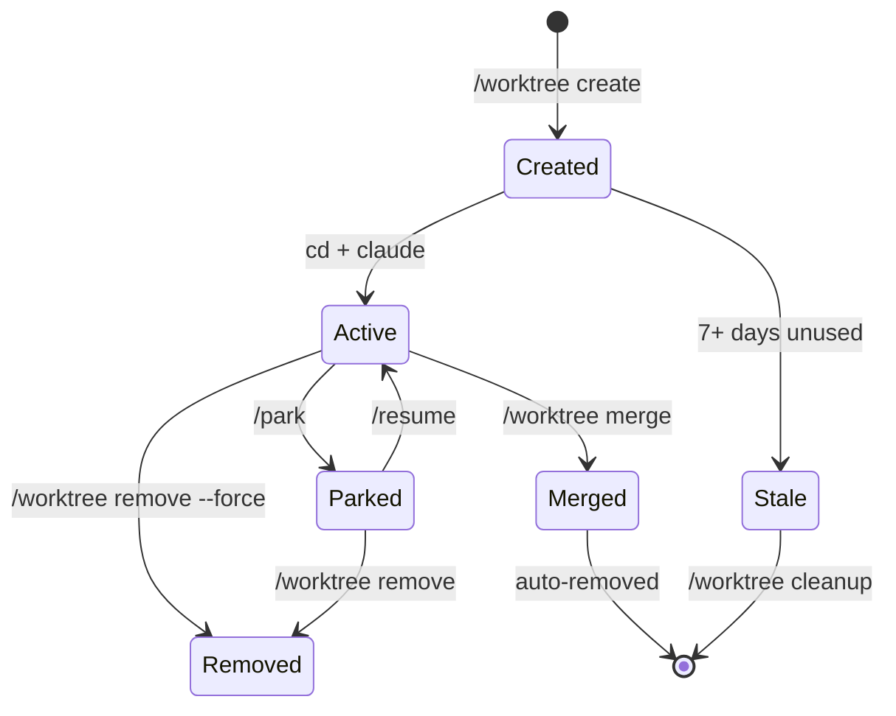

# Worktree Guide

> Git worktrees for running parallel AI coding assistant sessions with filesystem isolation.

Git worktrees enable running multiple independent sessions simultaneously, each with its own rite configuration, session state, and working files. This guide covers creation, lifecycle management, and production patterns.

---

## Why Worktrees?

### The Problem

The AI coding assistant sessions are designed for single-terminal execution. Each terminal tracks one active session in `.sos/sessions/.current-session`. Running multiple features simultaneously creates conflicts:

- Session state corruption from concurrent modifications
- Branch conflicts when features touch overlapping files
- Context pollution when switching between tasks

### The Solution

Git worktrees provide true filesystem isolation:

```
project/
├── {channel_dir}/              # Main worktree sessions
├── src/
└── worktrees/
    ├── wt-20260105-100000-abc/ # Feature A (its own channel dir, session, rite)
    └── wt-20260105-100500-def/ # Feature B (completely independent)
```

Each worktree is a fully independent working copy:
- Own channel directory with agents, sessions, rites
- Own branch/commit state (detached HEAD by default)
- Own working files (no conflicts with main worktree)

---

## Quick Start

### Create a Worktree

```bash
# Basic creation
/worktree create "auth-feature"

# With specific rite
/worktree create "auth-feature" --rite=10x-dev

# From specific branch
/worktree create "hotfix" --from=release-1.2
```

Output:
<!-- HA-CC: "claude" is the CC CLI binary name; replace with your harness's launch command -->
```json
{
  "worktree_id": "wt-20260105-100000-abc1234",
  "path": "/Users/you/project/worktrees/wt-20260105-100000-abc1234",
  "instructions": "cd /Users/you/project/worktrees/wt-20260105-100000-abc1234 && claude"
}
```

### Work in the Worktree

<!-- HA-CC: "claude" is the CC CLI binary name; replace with your harness's launch command -->
```bash
# Open new terminal
cd /Users/you/project/worktrees/wt-20260105-100000-abc1234
claude

# Now you have an isolated session with your chosen rite
/start "Implement OAuth"
```

### Clean Up

```bash
# From main project (not from within worktree)
/worktree remove wt-20260105-100000-abc1234

# Or wrap session (offers to remove worktree)
/wrap
```

---

## Worktree Lifecycle

<!-- HA-CC: "claude" in the state diagram is the CC CLI binary name; replace with your harness's launch command -->


### States

| State | Description | Next Actions |
|-------|-------------|--------------|
| **Created** | Worktree exists but no AI coding session | Start session with your harness's launch command |
| **Active** | Claude session in progress | Work, park, wrap, or remove |
| **Parked** | Session paused, preserving state | Resume, remove, or let cleanup collect |
| **Merged** | Changes merged to main branch | Auto-removed after merge |
| **Stale** | No activity for 7+ days | Cleanup will remove (unless changes exist) |

---

## CLI Reference

### Create

```bash
ari worktree create <name> [flags]

Flags:
  --rite=RITE      Set active rite (default: inherits from main)
  --from=REF       Create from branch/tag/commit (default: HEAD)
  --complexity=X   Session complexity: PATCH, MODULE, SYSTEM, INITIATIVE, MIGRATION
```

### List

```bash
ari worktree list

# Output fields:
# - id: Worktree identifier
# - path: Filesystem location
# - name: Human-readable name
# - team: Active rite
# - created_at: Creation timestamp
# - has_changes: Uncommitted modifications
# - session_status: none, active, or parked
```

### Status

```bash
ari worktree status [id]

# Without ID: summary of all worktrees
# With ID: detailed metadata for specific worktree
```

### Remove

```bash
ari worktree remove <id> [--force]

# --force: Override uncommitted changes check
```

### Cleanup

```bash
ari worktree cleanup [--older-than=DURATION] [--force]

# Removes worktrees that are:
# - 7+ days old (or custom duration)
# - No uncommitted changes (unless --force)
# - No active sessions
```

### Sync

```bash
ari worktree sync

# Pull latest changes from upstream into worktree
```

### Switch

```bash
ari worktree switch <id>

# Output instructions for switching to worktree
```

---

## Merge Operations

After completing work in a worktree, merge changes back to main branch using standard git commands or the worktree-manager script.

### Using Git Directly

```bash
# From main project root
cd /path/to/main/project

# Preview changes from worktree
git diff main...$(git -C worktrees/wt-xxx rev-parse HEAD)

# Merge worktree changes
git merge $(git -C worktrees/wt-xxx rev-parse HEAD)
```

### Using worktree-manager.sh

The worktree-manager script provides higher-level merge operations:

```bash
# Preview changes (excludes channel directory by default)
{channel_dir}/hooks/lib/worktree-manager.sh diff wt-xxx [--to=BRANCH]

# Merge with auto-cleanup
{channel_dir}/hooks/lib/worktree-manager.sh merge wt-xxx [--to=BRANCH]

# Cherry-pick specific commits
{channel_dir}/hooks/lib/worktree-manager.sh cherry-pick wt-xxx <commit...>
```

**Flags for merge:**
- `--to=BRANCH` — Target branch (default: main)
- `--include-claude` — Include channel directory (requires --yes)
- `--no-cleanup` — Keep worktree after merge
- `--force` — Discard uncommitted changes
- `--dry-run` — Preview without executing

---

## Channel Directory Exclusion

By default, merge and cherry-pick operations exclude the channel directory:

| Operation | Channel Directory Behavior |
|-----------|---------------------------|
| `diff` | Excluded from output |
| `merge` | Excluded from merge commit |
| `cherry-pick` | Excluded from applied commits |

**Rationale**: Session artifacts (session IDs, sprint context, agent state) are worktree-specific and should not propagate to main branch.

To include the channel directory (rare):
```bash
ari worktree merge <id> --include-claude --yes
```

---

## Production Patterns

### Pattern 1: Parallel Feature Development

Run two features simultaneously in separate terminals:

<!-- HA-CC: "claude" is the CC CLI binary name; replace with your harness's launch command -->
```bash
# Terminal 1: Auth feature
/worktree create "auth" --rite=10x-dev
cd worktrees/wt-xxx-auth && claude
/task "Implement OAuth2"

# Terminal 2: Payments feature
/worktree create "payments" --rite=10x-dev
cd worktrees/wt-xxx-payments && claude
/task "Implement Stripe integration"
```

### Pattern 2: Hotfix While Feature in Progress

<!-- HA-CC: "claude" is the CC CLI binary name; replace with your harness's launch command -->
```bash
# Main terminal: Feature work (parked)
/park "switching to hotfix"

# Create hotfix worktree from release branch
/worktree create "hotfix-123" --from=release-1.2 --rite=10x-dev
cd worktrees/wt-xxx && claude

# Fix, test, merge
/hotfix "Critical auth bug"
ari worktree merge wt-xxx --to=release-1.2

# Return to main and resume feature
cd /main/project && /resume
```

### Pattern 3: Different Rites Per Worktree

```bash
# Terminal 1: Development rite
/worktree create "feature" --rite=10x-dev

# Terminal 2: Documentation rite
/worktree create "docs" --rite=docs

# Terminal 3: Security review rite
/worktree create "security-audit" --rite=security
```

### Pattern 4: CI/CD Integration

```yaml
# .github/workflows/parallel-review.yml
jobs:
  security-review:
    steps:
      - uses: actions/checkout@v4
      - name: Create security worktree
        run: |
          git worktree add --detach /tmp/security-review HEAD
          cd /tmp/security-review
          ari sync materialize
          ari rite invoke security
          # Run security checks...

  docs-review:
    steps:
      - uses: actions/checkout@v4
      - name: Create docs worktree
        run: |
          git worktree add --detach /tmp/docs-review HEAD
          cd /tmp/docs-review
          ari sync materialize
          ari rite invoke docs
          # Run doc validation...
```

### Pattern 5: Session Seeding

Create multiple PARKED sessions for batch processing:

```bash
# Create sessions that start PARKED (ADR-0010 pattern)
ari session create "Feature A" --complexity=MODULE --seed
ari session create "Feature B" --complexity=MODULE --seed
ari session create "Feature C" --complexity=MODULE --seed

# Sessions exist in .sos/sessions/ but none are active
# Resume each in separate terminals
cd terminal-1 && ari session resume session-xxx-a
cd terminal-2 && ari session resume session-xxx-b
cd terminal-3 && ari session resume session-xxx-c
```

---

## Troubleshooting

### Cannot Create Worktree from Within Worktree

```
{"error": "Cannot create worktree from within a worktree. Navigate to main project first."}
```

**Solution**: `cd` to the main project root before creating new worktrees.

### Worktree Has Uncommitted Changes

```
{"error": "Worktree has uncommitted changes. Use --force to override."}
```

**Options**:
1. Commit changes: `cd worktree && git add . && git commit -m "WIP"`
2. Force remove: `ari worktree remove <id> --force`
3. Stash changes: `cd worktree && git stash`

### Cleanup Won't Remove Worktree

Cleanup skips worktrees with:
- Uncommitted changes
- Untracked files
- Active (non-parked) sessions

**Solution**: Use `--force` or address the blocking condition:
```bash
ari worktree cleanup --force

# Or manually clean up
cd worktree && git status  # See what's blocking
```

### Merge Conflict

```
{"error": "Merge conflict occurred. Resolve manually or use cherry-pick for selective commits."}
```

**Options**:
1. Resolve manually:
   ```bash
   git checkout main
   git merge --no-commit <worktree-head>
   # Resolve conflicts
   git commit
   ```
2. Cherry-pick specific commits to avoid conflicts
3. Rebase worktree onto latest main first

### Worktree Path Not Found

Worktrees live in `project/worktrees/wt-*`. If the path is missing:

```bash
# Prune orphaned worktree references
git worktree prune

# Recreate if needed
/worktree create "name"
```

---

## Architecture

### Directory Structure

```
project/
├── {channel_dir}/
│   ├── sessions/
│   │   └── .current-session      # Tracks main worktree session
│   └── ACTIVE_RITE
├── worktrees/
│   ├── .gitignore                # Contains '*' to ignore worktrees
│   └── wt-20260105-100000-abc/
│       ├── {channel_dir}/
│       │   ├── .worktree-meta.json    # Worktree metadata
│       │   ├── sessions/
│       │   │   └── .current-session   # Tracks THIS worktree's session
│       │   └── ACTIVE_RITE            # May differ from main
│       └── src/                       # Working files
└── src/
```

### Worktree Metadata

Each worktree has `.knossos/.worktree-meta.json`:

```json
{
  "worktree_id": "wt-20260105-100000-abc1234",
  "created_at": "2026-01-05T10:00:00Z",
  "name": "auth-feature",
  "from_ref": "HEAD",
  "team": "10x-dev",
  "complexity": "MODULE",
  "parent_project": "/Users/you/project"
}
```

### Git Worktree Mechanics

Worktrees use detached HEAD to avoid branch pollution:

```bash
# How creation works internally
git worktree add --detach /path/to/worktree HEAD

# Worktree has its own git directory link
cat worktree/.git
# gitdir: /main/project/.git/worktrees/wt-xxx
```

---

## Best Practices

### Do

- Create worktrees from main project (not from within worktrees)
- Use descriptive names: `auth-oauth`, `payments-stripe`, `hotfix-123`
- Park sessions before switching terminals
- Clean up stale worktrees regularly
- Commit frequently within worktrees

### Don't

- Create worktrees within worktrees (blocked by design)
- Include the channel directory in merges without explicit reason
- Leave uncommitted changes in stale worktrees
- Assume worktree branches exist (they're detached HEAD)
- Forget to prune orphaned git refs periodically

---

## See Also

- [CLI: worktree](../operations/cli-reference/cli-worktree.md) — Command reference
- [CLI: session](../operations/cli-reference/cli-session.md) — Session management
