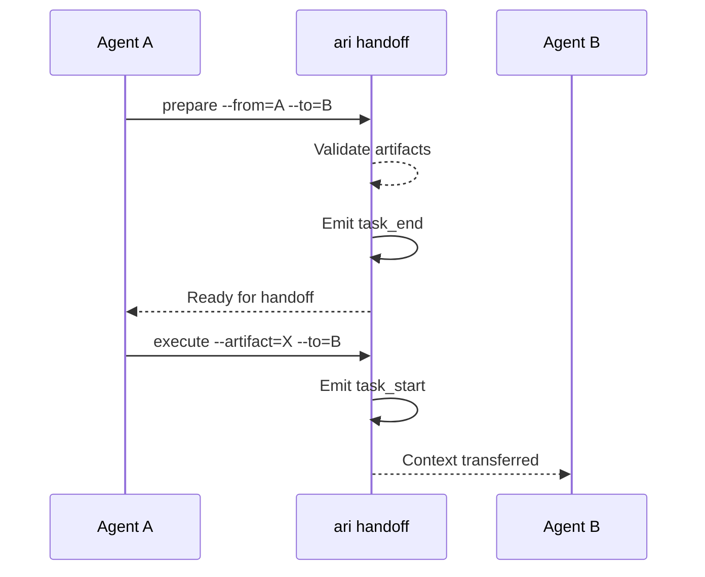

# CLI Reference: handoff

> Manage agent handoffs between workflow phases.

Handoffs transfer work from one agent to another within a session, ensuring proper artifact validation and context preservation.

**Family**: handoff
**Commands**: 4
**Priority**: MEDIUM

---

## Commands

### ari handoff prepare

Prepare for handoff between agents.

**Synopsis**:
```bash
ari handoff prepare [flags]
```

**Description**:
Validates readiness for handoff and emits `task_end` event. Checks that required artifacts exist and meet quality criteria before allowing handoff.

**Flags**:
| Flag | Type | Default | Description |
|------|------|---------|-------------|
| `--from` | string | - | Source agent name |
| `--to` | string | - | Target agent name |

**Examples**:
```bash
# Prepare handoff from architect to engineer
ari handoff prepare --from=architect --to=principal-engineer

# Check readiness
ari handoff prepare --from=requirements-analyst --to=architect
```

**Related Commands**:
- [`ari handoff execute`](#ari-handoff-execute) — Execute prepared handoff
- [`ari validate handoff`](cli-validate.md#ari-validate-handoff) — Validate handoff criteria

---

### ari handoff execute

Execute a prepared handoff.

**Synopsis**:
```bash
ari handoff execute [flags]
```

**Description**:
Triggers the transition and emits `task_start` event for the receiving agent. Should be called after successful prepare.

**Flags**:
| Flag | Type | Default | Description |
|------|------|---------|-------------|
| `--artifact` | string | - | Artifact being handed off (e.g., TDD-user-auth) |
| `--to` | string | - | Target agent name |

**Examples**:
```bash
# Execute handoff with artifact
ari handoff execute --artifact=TDD-user-auth --to=principal-engineer

# Execute to QA
ari handoff execute --artifact=implementation-complete --to=qa-adversary
```

**Related Commands**:
- [`ari handoff prepare`](#ari-handoff-prepare) — Prepare before executing
- [`ari session transition`](cli-session.md#ari-session-transition) — Phase transition

---

### ari handoff status

Show current handoff status.

**Synopsis**:
```bash
ari handoff status [flags]
```

**Description**:
Queries the current handoff state including pending handoffs, last completed handoff, and validation status.

**Examples**:
```bash
# Check handoff status
ari handoff status

# JSON output
ari handoff status -o json
```

**Related Commands**:
- [`ari handoff history`](#ari-handoff-history) — Full handoff history

---

### ari handoff history

Show handoff history.

**Synopsis**:
```bash
ari handoff history [flags]
```

**Description**:
Queries handoff events from `events.jsonl` showing all handoffs in the session with timestamps and outcomes.

**Flags**:
| Flag | Type | Default | Description |
|------|------|---------|-------------|
| `--limit` | int | 10 | Maximum entries to return |

**Examples**:
```bash
# Recent handoffs
ari handoff history

# More history
ari handoff history --limit=50

# JSON for analysis
ari handoff history -o json
```

**Related Commands**:
- [`ari session audit`](cli-session.md#ari-session-audit) — All session events

---

## Global Flags

| Flag | Type | Default | Description |
|------|------|---------|-------------|
| `--config` | string | `$XDG_CONFIG_HOME/ariadne/config.yaml` | Config file path |
| `-o, --output` | string | `text` | Output format: text, json, yaml |
| `-p, --project-dir` | string | auto-discovered | Project root directory |
| `-s, --session-id` | string | current session | Override session ID |
| `-v, --verbose` | bool | false | Enable verbose output |

---

## Handoff Flow



---

## See Also

- [Knossos Doctrine - Handoffs](../../philosophy/knossos-doctrine.md)
- [Handoff Skill](/handoff)
