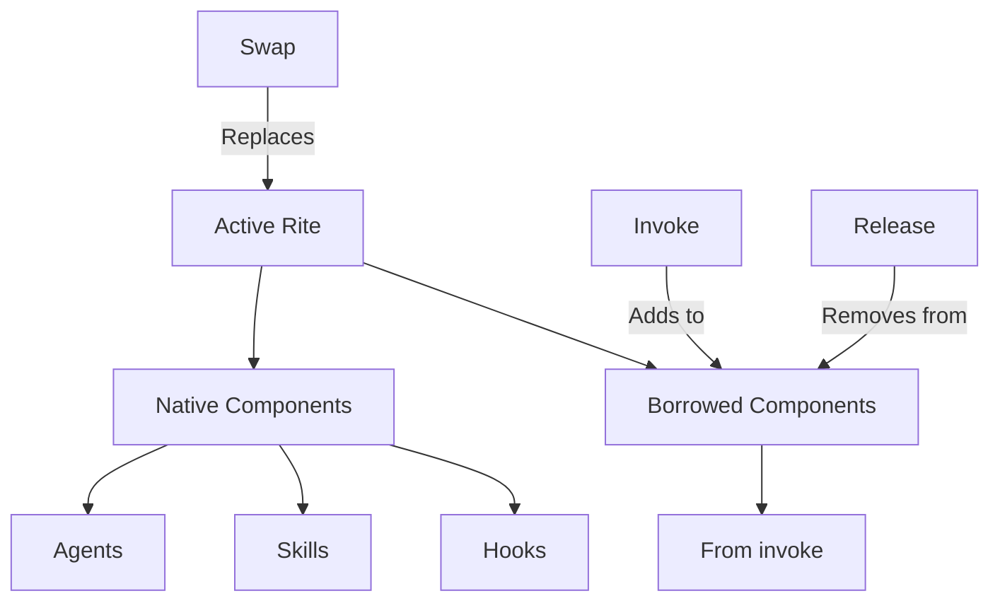

# CLI Reference: rite

> Manage rite invocations and composition.

[Rites](../../reference/GLOSSARY.md#rite) are composable practice bundles containing agents, skills, hooks, and workflows. The invoke operation is additive (borrow components), while swap is replacement (full context switch).

**Family**: rite
**Commands**: 10
**Priority**: HIGH

---

## Commands

### ari rite list

List available rites.

**Synopsis**:
```bash
ari rite list [flags]
```

**Description**:
Lists all rites from project and user directories. Shows rite name, description, form, and component counts.

**Flags**:
| Flag | Type | Default | Description |
|------|------|---------|-------------|
| `--form` | string | - | Filter by form: simple, practitioner, procedural, full |
| `--project` | bool | false | Show project rites only |
| `--user` | bool | false | Show user rites only |

**Examples**:
```bash
# List all available rites
ari rite list

# Show only full-form rites (multi-agent workflows)
ari rite list --form=full

# Project rites as JSON
ari rite list --project -o json
```

**Related Commands**:
- [`ari rite info`](#ari-rite-info) — Detailed rite information
- [`ari rite pantheon`](#ari-rite-pantheon) — Show active agents

---

### ari rite current

Show active rite and borrowed components.

**Synopsis**:
```bash
ari rite current [flags]
```

**Description**:
Displays the currently active rite, its native components, and any borrowed components from invocations.

**Flags**:
| Flag | Type | Default | Description |
|------|------|---------|-------------|
| `--borrowed` | bool | false | Show only borrowed components |
| `--native` | bool | false | Show only native components |

**Examples**:
```bash
# Show full current state
ari rite current

# Show what's been borrowed
ari rite current --borrowed

# Native components only
ari rite current --native -o yaml
```

**Related Commands**:
- [`ari rite invoke`](#ari-rite-invoke) — Borrow components
- [`ari rite release`](#ari-rite-release) — Release borrowed components

---

### ari rite info

Display detailed rite information.

**Synopsis**:
```bash
ari rite info <name> [flags]
```

**Description**:
Shows comprehensive information about a rite including agents, skills, workflow phases, hooks, and token budget.

**Arguments**:
- `name` (string, required): Rite name to inspect

**Flags**:
| Flag | Type | Default | Description |
|------|------|---------|-------------|
| `--budget` | bool | false | Show detailed budget breakdown |
| `--components` | bool | false | Show component list only |

**Examples**:
```bash
# Full rite information
ari rite info 10x-dev

# Component summary
ari rite info docs --components

# Token budget analysis
ari rite info security --budget -o json
```

**Related Commands**:
- [`ari rite list`](#ari-rite-list) — List all rites
- [Rite Catalog](../../rites/) — Full rite documentation

---

### ari rite invoke

Borrow components from another rite.

**Synopsis**:
```bash
ari rite invoke <name> [component] [flags]
```

**Description**:
Additively borrows components from another rite without switching context. Useful for temporarily accessing skills or agents from a different rite.

**Arguments**:
- `name` (string, required): Rite to borrow from
- `component` (string, optional): `skills`, `agents`, or omit for all

**Flags**:
| Flag | Type | Default | Description |
|------|------|---------|-------------|
| `--dry-run` | bool | false | Preview injection without applying |
| `--no-inscription` | bool | false | Skip context file updates |

**Examples**:
```bash
# Borrow entire rite
ari rite invoke documentation

# Borrow skills only
ari rite invoke documentation skills

# Borrow agents only (preview)
ari rite invoke security agents --dry-run

# Borrow without updating inscription
ari rite invoke code-review --no-inscription
```

**Related Commands**:
- [`ari rite release`](#ari-rite-release) — Release borrowed components
- [`ari rite current`](#ari-rite-current) — Show borrowed state

---

### ari rite release

Release borrowed components.

**Synopsis**:
```bash
ari rite release [name|invocation-id] [flags]
```

**Description**:
Releases components borrowed from a previous invocation. Can release by rite name, invocation ID, or all borrowed components.

**Arguments**:
- `name|invocation-id` (string, optional): Rite name or invocation ID

**Flags**:
| Flag | Type | Default | Description |
|------|------|---------|-------------|
| `--all` | bool | false | Release all borrowed components |
| `--dry-run` | bool | false | Preview cleanup without applying |

**Examples**:
```bash
# Release specific rite
ari rite release documentation

# Release all borrowed components
ari rite release --all

# Release by invocation ID
ari rite release inv-20260106-abc123

# Preview release
ari rite release documentation --dry-run
```

**Related Commands**:
- [`ari rite invoke`](#ari-rite-invoke) — Borrow components
- [`ari rite swap`](#ari-rite-swap) — Full context switch (auto-releases)

---

### ari rite swap

Full context switch to another rite.

**Synopsis**:
```bash
ari rite swap <name> [flags]
```

**Description**:
Performs a complete rite replacement (not additive). Releases any active invocations before switching. This is equivalent to changing teams mid-session.

**Arguments**:
- `name` (string, required): Target rite name

**Flags**:
| Flag | Type | Default | Description |
|------|------|---------|-------------|
| `--dry-run` | bool | false | Preview changes without applying |
| `-k, --keep-orphans` | bool | false | Keep orphaned agents in `.channel/agents/` (default: remove with backup) |
| `--no-sync` | bool | false | Skip context file inscription sync |

**Examples**:
```bash
# Switch to security rite
ari rite swap security

# Preview swap
ari rite swap docs --dry-run

# Keep orphaned agents (prevent removal)
ari rite swap hygiene --keep-orphans
```

**Related Commands**:
- [`ari rite invoke`](#ari-rite-invoke) — Additive borrowing (not replacement)
- [`ari sync --rite`](cli-sync.md#ari-sync-materialize) — Unified sync command (replaces `ari rite swap` and `ari sync materialize`)

---

### ari rite status

Show rite status.

**Synopsis**:
```bash
ari rite status [flags]
```

**Description**:
Shows detailed status of the active or specified rite including validation state, component counts, and any issues.

**Flags**:
| Flag | Type | Default | Description |
|------|------|---------|-------------|
| `-r, --rite` | string | active rite | Rite to query |

**Examples**:
```bash
# Current rite status
ari rite status

# Specific rite status
ari rite status --rite=docs -o json
```

**Related Commands**:
- [`ari rite validate`](#ari-rite-validate) — Full validation
- [`ari rite current`](#ari-rite-current) — Quick status

---

### ari rite validate

Validate rite integrity.

**Synopsis**:
```bash
ari rite validate [flags]
```

**Description**:
Validates rite structure and configuration. Checks manifest schema, agent references, skill availability, and hook configuration.

**Flags**:
| Flag | Type | Default | Description |
|------|------|---------|-------------|
| `--fix` | bool | false | Attempt automatic repairs |
| `-r, --rite` | string | active rite | Rite to validate |

**Examples**:
```bash
# Validate current rite
ari rite validate

# Validate with auto-fix
ari rite validate --fix

# Validate specific rite
ari rite validate --rite=10x-dev -o json
```

**Related Commands**:
- [`ari validate artifact`](cli-validate.md#ari-validate-artifact) — Artifact validation
- [`ari manifest validate`](cli-manifest.md#ari-manifest-validate) — Manifest validation

---

### ari rite context

Display rite context injection data.

**Synopsis**:
```bash
ari rite context [flags]
```

**Description**:
Shows the context data injected into Claude sessions when the rite is active. Useful for debugging and understanding what Claude sees.

**Flags**:
| Flag | Type | Default | Description |
|------|------|---------|-------------|
| `--format` | string | `markdown` | Output format: markdown, json, yaml |
| `-r, --rite` | string | active rite | Rite to inspect |

**Examples**:
```bash
# Show current rite context
ari rite context

# Show as YAML
ari rite context --format=yaml

# Specific rite context
ari rite context --rite=10x-dev
```

**Related Commands**:
- [`ari hook context`](cli-hook.md#ari-hook-context) — Session context injection

---

### ari rite pantheon

Display active agents.

**Synopsis**:
```bash
ari rite pantheon [flags]
```

**Description**:
Shows all agents available in the current rite along with their roles. The "pantheon" is the set of [heroes](../../reference/GLOSSARY.md#heroes) available for Task tool delegation.

**Examples**:
```bash
# Show agent pantheon
ari rite pantheon

# JSON for scripting
ari rite pantheon -o json
```

**Related Commands**:
- [`ari rite info`](#ari-rite-info) — Full rite details
- [Rite Catalog](../../rites/) — Agent documentation per rite

---

## Global Flags

All rite commands support these global flags:

| Flag | Type | Default | Description |
|------|------|---------|-------------|
| `--config` | string | `$XDG_CONFIG_HOME/ariadne/config.yaml` | Config file path |
| `-o, --output` | string | `text` | Output format: text, json, yaml |
| `-p, --project-dir` | string | auto-discovered | Project root directory |
| `-s, --session-id` | string | current session | Override session ID |
| `-v, --verbose` | bool | false | Enable verbose output |

---

## Rite Composition Model



---

## See Also

- [Rite Catalog](../../rites/) — Full rite documentation
- [Knossos Doctrine - Rite System](../../philosophy/knossos-doctrine.md)
- [Rite Glossary Entry](../../reference/GLOSSARY.md#rite)
