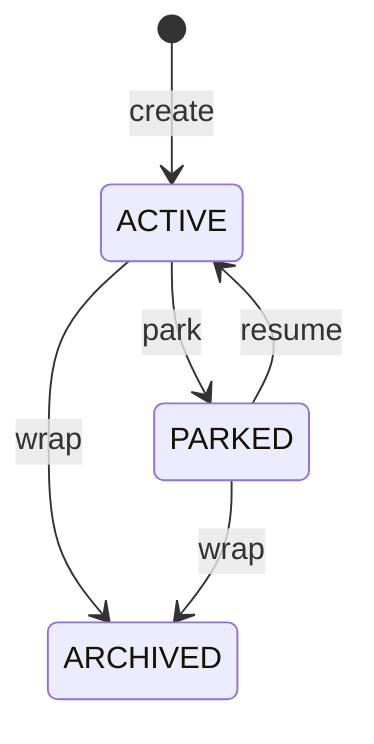

# CLI Reference: session

> Manage workflow sessions with lifecycle state transitions.

Sessions track work context through the [Moirai](../../reference/GLOSSARY.md#moirai) lifecycle: create → park → resume → wrap. Each session has an initiative, complexity level, and maintains an [event log](../../reference/GLOSSARY.md#event-log) (the clew).

**Family**: session
**Commands**: 10
**Priority**: HIGH

---

## Commands

### ari session create

Create a new session, transitioning from NONE to ACTIVE state.

**Synopsis**:
```bash
ari session create <initiative> [flags]
```

**Description**:
Initializes a new tracked work session. Creates session directory in `.claude/sessions/`, initializes `SESSION_CONTEXT.md`, and records `SessionCreated` event. The session ID is automatically generated.

**Arguments**:
- `initiative` (string, required): Session title/goal describing the work

**Flags**:
| Flag | Type | Default | Description |
|------|------|---------|-------------|
| `-c, --complexity` | string | `MODULE` | Complexity level: PATCH, MODULE, SYSTEM, INITIATIVE, MIGRATION |
| `-r, --rite` | string | from ACTIVE_RITE | [Rite](../../reference/GLOSSARY.md#rite) to activate |
| `--seed` | bool | false | Create session in ephemeral [worktree](../../reference/GLOSSARY.md#worktree), park it, copy to main |
| `--seed-keep` | bool | false | Keep worktree after seeding (for debugging) |
| `--seed-prefix` | string | `/tmp/roster-seed-` | Custom prefix for ephemeral worktree path |

**Examples**:
```bash
# Create a MODULE complexity session
ari session create "Add user authentication"

# Create with explicit complexity
ari session create "Database migration to PostgreSQL" --complexity=MIGRATION

# Create with specific rite
ari session create "Document API endpoints" --rite=docs

# Seed pattern for parallel work
ari session create "Experiment with caching" --seed
```

**Related Commands**:
- [`ari session status`](#ari-session-status) — Check current session state
- [`ari session park`](#ari-session-park) — Suspend session
- [`ari worktree create`](cli-worktree.md#ari-worktree-create) — Create isolated worktree

---

### ari session list

List sessions with optional filtering.

**Synopsis**:
```bash
ari session list [flags]
```

**Description**:
Lists sessions in the project, optionally filtered by status. Shows session ID, initiative, status, and timestamps. Parked sessions older than `ARIADNE_STALE_SESSION_DAYS` (default: 2 days) are annotated as stale with a suggestion to wrap them.

**Flags**:
| Flag | Type | Default | Description |
|------|------|---------|-------------|
| `-a, --all` | bool | false | Include archived sessions |
| `-n, --limit` | int | 20 | Maximum sessions to return |
| `--status` | string | - | Filter by status: ACTIVE, PARKED, ARCHIVED |

**Examples**:
```bash
# List recent sessions
ari session list

# Show only parked sessions
ari session list --status=PARKED

# Include archived, limit to 50
ari session list --all --limit=50

# JSON output for scripting
ari session list -o json
```

**Related Commands**:
- [`ari session status`](#ari-session-status) — Detailed status of current session
- [`ari naxos scan`](cli-naxos.md#ari-naxos-scan) — Find orphaned sessions

---

### ari session status

Show current session state with comprehensive metadata.

**Synopsis**:
```bash
ari session status [flags]
```

**Description**:
Returns detailed information about the current session including initiative, complexity, phase, active rite, and event counts.

**Examples**:
```bash
# Check current session
ari session status

# JSON output for parsing
ari session status -o json

# Check specific session
ari session status -s session-20260108-143052-a1b2
```

**Related Commands**:
- [`ari session audit`](#ari-session-audit) — View event history
- [`ari sails check`](cli-sails.md#ari-sails-check) — Check quality gate status

---

### ari session park

Suspend the current session (ACTIVE → PARKED).

**Synopsis**:
```bash
ari session park [flags]
```

**Description**:
Suspends the active session, preserving state for later resumption. Records `SessionParked` event with reason. Use when taking breaks, encountering blockers, or switching context.

**Flags**:
| Flag | Type | Default | Description |
|------|------|---------|-------------|
| `-r, --reason` | string | `Manual park` | Reason for parking |

**Examples**:
```bash
# Park with default reason
ari session park

# Park with specific reason
ari session park --reason="Waiting for API credentials"

# Park from cognitive budget threshold
ari session park --reason="Budget threshold reached"
```

**Related Commands**:
- [`ari session resume`](#ari-session-resume) — Resume parked session
- `/park` skill — Claude Code skill equivalent

---

### ari session resume

Resume a parked session (PARKED → ACTIVE).

**Synopsis**:
```bash
ari session resume [flags]
```

**Description**:
Resumes a previously parked session, restoring full context from the [clew](../../reference/GLOSSARY.md#clew). Records `SessionResumed` event.

**Examples**:
```bash
# Resume the parked session
ari session resume

# Resume specific session
ari session resume -s session-20260108-143052-a1b2
```

**Related Commands**:
- [`ari session park`](#ari-session-park) — Suspend session
- `/resume` skill — Claude Code skill equivalent

---

### ari session wrap

Complete and archive a session.

**Synopsis**:
```bash
ari session wrap [flags]
```

**Description**:
Completes the session, generating [White Sails](../../reference/GLOSSARY.md#white-sails) confidence signal and transitioning to ARCHIVED state. Runs quality gates unless forced. After a successful wrap, scans for stale parked sessions and reports them to stderr.

**Flags**:
| Flag | Type | Default | Description |
|------|------|---------|-------------|
| `--force` | bool | false | Force wrap even with BLACK sails |
| `--no-archive` | bool | false | Don't move to archive directory |

**Examples**:
```bash
# Wrap with quality gates
ari session wrap

# Force wrap despite failing gates
ari session wrap --force

# Wrap but keep in active directory
ari session wrap --no-archive
```

**Related Commands**:
- [`ari sails check`](cli-sails.md#ari-sails-check) — Check quality gate before wrap
- `/wrap` skill — Claude Code skill equivalent

---

### ari session audit

Display session event history.

**Synopsis**:
```bash
ari session audit [flags]
```

**Description**:
Shows events from `events.jsonl` for the session. Useful for debugging, provenance tracking, and understanding session history.

**Flags**:
| Flag | Type | Default | Description |
|------|------|---------|-------------|
| `-e, --event-type` | string | - | Filter by event type |
| `-n, --limit` | int | 50 | Maximum events to return |
| `--since` | string | - | Only events after this ISO8601 timestamp |

**Examples**:
```bash
# Show recent events
ari session audit

# Filter to handoff events
ari session audit --event-type=handoff

# Events from last hour
ari session audit --since="2026-01-08T10:00:00Z"

# Last 100 events as JSON
ari session audit --limit=100 -o json
```

**Related Commands**:
- [`ari handoff history`](cli-handoff.md#ari-handoff-history) — Handoff-specific events

---

### ari session transition

Transition between workflow phases.

**Synopsis**:
```bash
ari session transition <phase> [flags]
```

**Description**:
Moves the session to a new workflow phase. Valid phases: `requirements`, `design`, `implementation`, `validation`, `complete`. Records phase transition event.

**Arguments**:
- `phase` (string, required): Target phase

**Flags**:
| Flag | Type | Default | Description |
|------|------|---------|-------------|
| `-f, --force` | bool | false | Skip artifact validation |

**Examples**:
```bash
# Transition to implementation
ari session transition implementation

# Force transition without validation
ari session transition validation --force
```

**Related Commands**:
- [`ari handoff execute`](cli-handoff.md#ari-handoff-execute) — Agent handoff with transition
- [Moirai](../../reference/GLOSSARY.md#moirai) — Phase management authority

---

### ari session recover

Clean up stale locks and rebuild session cache.

**Synopsis**:
```bash
ari session recover [flags]
```

**Description**:
Recovers from stale locks and inconsistent session state. Scans all lock files for stale entries (older than 5 minutes), removes them, scans session directories for the ACTIVE session, and rebuilds the `.current-session` cache. Use `--dry-run` to preview what would be fixed without making changes.

This command replaces the former `ari session lock` and `ari session unlock` commands which were removed in v0.2.0.

**Flags**:
| Flag | Type | Default | Description |
|------|------|---------|-------------|
| `--dry-run` | bool | false | Preview changes without applying |

**Examples**:
```bash
# Preview recovery actions
ari session recover --dry-run

# Clean up stale locks and rebuild cache
ari session recover
```

**Related Commands**:
- [`ari session status`](#ari-session-status) — Check current session state
- [`ari session list`](#ari-session-list) — List sessions

---

### ari session migrate

Migrate sessions to v2 schema.

**Synopsis**:
```bash
ari session migrate [flags]
```

**Description**:
Migrates session(s) from v1 to v2.1 schema format. Use after platform upgrades.

**Flags**:
| Flag | Type | Default | Description |
|------|------|---------|-------------|
| `-a, --all` | bool | false | Migrate all v1 sessions |
| `--dry-run` | bool | false | Preview changes without applying |

**Examples**:
```bash
# Preview migration
ari session migrate --dry-run

# Migrate current session
ari session migrate

# Migrate all sessions
ari session migrate --all
```

---

## Global Flags

All session commands support these global flags:

| Flag | Type | Default | Description |
|------|------|---------|-------------|
| `--config` | string | `$XDG_CONFIG_HOME/ariadne/config.yaml` | Config file path |
| `-o, --output` | string | `text` | Output format: text, json, yaml |
| `-p, --project-dir` | string | auto-discovered | Project root directory |
| `-s, --session-id` | string | current session | Override session ID |
| `-v, --verbose` | bool | false | Enable verbose output (JSON lines to stderr) |

---

## Session Lifecycle



---

## See Also

- [Knossos Doctrine - Session Lifecycle](../../philosophy/knossos-doctrine.md)
- [Moirai Glossary Entry](../../reference/GLOSSARY.md#moirai)
- [CLI: sails](cli-sails.md) — Confidence signal generation
