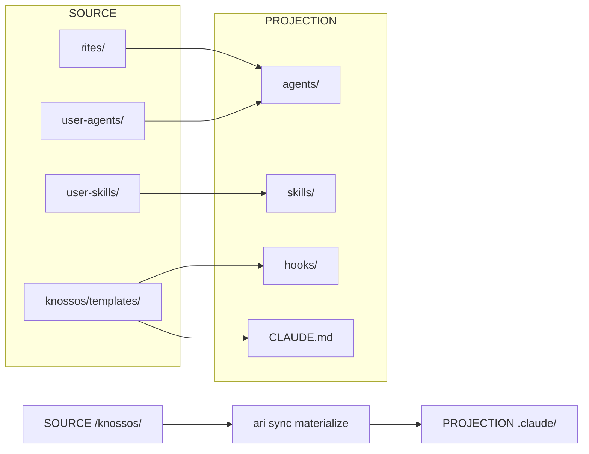

# CLI Reference: sync

> Synchronize .claude/ configuration with remotes.

The sync system tracks changes to configuration files, enabling pulling updates from remotes, pushing local changes, and materializing the `.claude/` directory from [SOURCE](../../reference/GLOSSARY.md#source).

**Family**: sync
**Commands**: 8
**Priority**: HIGH

---

## Commands

### ari sync status

Show sync status.

**Synopsis**:
```bash
ari sync status [flags]
```

**Description**:
Shows the synchronization status of all tracked configuration files including remote source URL, last sync timestamp, file states, and any unresolved conflicts.

**Examples**:
```bash
# Check sync status
ari sync status

# JSON output for scripting
ari sync status -o json
```

**Output States**:
- `synced`: File matches remote
- `modified`: Local changes since last sync
- `conflict`: Both local and remote changed
- `new`: File not tracked yet

**Related Commands**:
- [`ari sync diff`](#ari-sync-diff) — See differences
- [`ari sync pull`](#ari-sync-pull) — Pull remote changes

---

### ari sync materialize

Generate .claude/ directory from SOURCE.

**Synopsis**:
```bash
ari sync materialize [flags]
```

**Description**:
Generates the complete `.claude/` directory structure from [SOURCE](../../reference/GLOSSARY.md#source) templates and rite manifests. This is an idempotent operation—safe to run multiple times.

**Sources**:
- `templates/` — Hooks, CLAUDE.md sections
- `rites/{active}/` — Agents, skills from active rite
- `rites/shared/` — Shared skills

**Flags**:
| Flag | Type | Default | Description |
|------|------|---------|-------------|
| `--dry-run` | bool | false | Preview changes without applying |
| `-f, --force` | bool | false | Force regeneration, overwriting local changes |
| `--keep-orphans` | bool | true | Preserve orphan agents in `.claude/agents/` |
| `--rite` | string | current | Rite to materialize |

**Examples**:
```bash
# Materialize current rite
ari sync materialize

# Preview what would change
ari sync materialize --dry-run

# Materialize specific rite
ari sync materialize --rite=docs

# Force regeneration
ari sync materialize --force

# Remove orphaned agents (default behavior)
ari sync materialize
```

**Orphan Handling**:
When switching rites, agents from the previous rite become "orphans" and are removed by default (with backup). Use `--keep-orphans` to preserve them in `.claude/agents/`.

**Related Commands**:
- [`ari sync --rite`](cli-rite.md#ari-rite-swap) — Switch rites (replaces `ari rite swap`)
- [`ari inscription sync`](cli-inscription.md#ari-inscription-sync) — Sync CLAUDE.md only

---

### ari sync pull

Pull remote changes.

**Synopsis**:
```bash
ari sync pull [remote] [flags]
```

**Description**:
Pulls changes from the remote source with three-way conflict detection. If remote is not specified, uses the previously configured remote.

**Arguments**:
- `remote` (string, optional): Remote source URL or path

**Remote Formats**:
- Local path: `/path/to/source` or `./relative`
- HTTP(S): `https://example.com/config`
- GitHub: `org/repo` (uses raw.githubusercontent.com)
- Git ref: `HEAD:.claude/path`

**Flags**:
| Flag | Type | Default | Description |
|------|------|---------|-------------|
| `--dry-run` | bool | false | Preview changes without applying |
| `-f, --force` | bool | false | Force overwrite even with conflicts |
| `--path` | strings | - | Specific paths to pull (can repeat) |

**Examples**:
```bash
# Pull from configured remote
ari sync pull

# Pull from specific remote
ari sync pull /path/to/knossos

# Pull specific files
ari sync pull --path=agents/ --path=skills/

# Preview pull
ari sync pull --dry-run

# Force overwrite conflicts
ari sync pull --force
```

**Related Commands**:
- [`ari sync push`](#ari-sync-push) — Push local changes
- [`ari sync resolve`](#ari-sync-resolve) — Resolve conflicts

---

### ari sync push

Push local changes to remote.

**Synopsis**:
```bash
ari sync push [flags]
```

**Description**:
Pushes local configuration changes to the remote. Currently only supports local filesystem remotes.

**Pre-push Checks**:
- Verifies no unresolved conflicts
- Checks remote hasn't changed since last pull
- Use `--force` to override safety checks

**Flags**:
| Flag | Type | Default | Description |
|------|------|---------|-------------|
| `--dry-run` | bool | false | Preview changes without applying |
| `-f, --force` | bool | false | Force push even with conflicts |
| `--path` | strings | - | Specific paths to push (can repeat) |

**Examples**:
```bash
# Push all changes
ari sync push

# Push specific path
ari sync push --path=agents/custom-agent.md

# Force push
ari sync push --force

# Preview push
ari sync push --dry-run
```

**Related Commands**:
- [`ari sync pull`](#ari-sync-pull) — Pull before pushing
- [`ari sync status`](#ari-sync-status) — Check what's changed

---

### ari sync diff

Show differences.

**Synopsis**:
```bash
ari sync diff [path] [flags]
```

**Description**:
Shows differences between local and remote configuration. Without arguments, shows summary of all changed files. With a path argument, shows detailed diff for that file.

**Arguments**:
- `path` (string, optional): Specific file to diff

**Flags**:
| Flag | Type | Default | Description |
|------|------|---------|-------------|
| `--full` | bool | false | Show full content (not just summary) |

**Examples**:
```bash
# Summary of all changes
ari sync diff

# Detailed diff for specific file
ari sync diff agents/orchestrator.md

# Full content comparison
ari sync diff --full
```

**Related Commands**:
- [`ari sync status`](#ari-sync-status) — Quick status check
- [`ari inscription diff`](cli-inscription.md#ari-inscription-diff) — CLAUDE.md diff

---

### ari sync resolve

Resolve sync conflicts.

**Synopsis**:
```bash
ari sync resolve [path] [flags]
```

**Description**:
Resolves sync conflicts using the specified strategy. Without a path, resolves all conflicts.

**Arguments**:
- `path` (string, optional): Specific conflict to resolve

**Strategies**:
- `ours`: Keep local changes, discard remote
- `theirs`: Accept remote changes, discard local
- `merge`: Attempt three-way merge (JSON files only)

**Flags**:
| Flag | Type | Default | Description |
|------|------|---------|-------------|
| `--dry-run` | bool | false | Preview resolution without applying |
| `--strategy` | string | `ours` | Resolution strategy: ours, theirs, merge |

**Examples**:
```bash
# Resolve all conflicts with local version
ari sync resolve --strategy=ours

# Accept remote changes
ari sync resolve --strategy=theirs

# Resolve specific conflict
ari sync resolve agents/custom.md --strategy=merge

# Preview resolution
ari sync resolve --dry-run
```

**Related Commands**:
- [`ari sync status`](#ari-sync-status) — See conflicts
- [`ari sync pull`](#ari-sync-pull) — May create conflicts

---

### ari sync reset

Reset sync state.

**Synopsis**:
```bash
ari sync reset [flags]
```

**Description**:
Resets sync tracking state. Without `--hard`, only clears state.json. With `--hard`, also reverts tracked files to their remote versions.

**⚠️ Warning**: This can cause data loss. Use `--force` to skip confirmation.

**Flags**:
| Flag | Type | Default | Description |
|------|------|---------|-------------|
| `-f, --force` | bool | false | Skip confirmation prompt |
| `--hard` | bool | false | Also revert files to remote versions |

**Examples**:
```bash
# Reset tracking state only
ari sync reset

# Hard reset (revert all files)
ari sync reset --hard

# Skip confirmation
ari sync reset --hard --force
```

**Related Commands**:
- [`ari sync materialize`](#ari-sync-materialize) — Regenerate from scratch

---

### ari sync history

Show sync history.

**Synopsis**:
```bash
ari sync history [flags]
```

**Description**:
Shows the history of sync operations including timestamps, operation types, files affected, and success/failure status.

**Flags**:
| Flag | Type | Default | Description |
|------|------|---------|-------------|
| `-n, --limit` | int | 20 | Maximum entries to show |
| `--operation` | string | - | Filter by operation type |
| `--since` | string | - | Show entries since timestamp (RFC3339) |

**Examples**:
```bash
# Recent history
ari sync history

# Last 50 entries
ari sync history --limit=50

# Only pull operations
ari sync history --operation=pull

# Since yesterday
ari sync history --since="2026-01-07T00:00:00Z"
```

**Related Commands**:
- [`ari session audit`](cli-session.md#ari-session-audit) — Session event history

---

## Global Flags

All sync commands support these global flags:

| Flag | Type | Default | Description |
|------|------|---------|-------------|
| `--config` | string | `$XDG_CONFIG_HOME/ariadne/config.yaml` | Config file path |
| `-o, --output` | string | `text` | Output format: text, json, yaml |
| `-p, --project-dir` | string | auto-discovered | Project root directory |
| `-s, --session-id` | string | current session | Override session ID |
| `-v, --verbose` | bool | false | Enable verbose output |

---

## Materialization Flow



---

## See Also

- [SOURCE vs PROJECTION](../../philosophy/mythology-concordance.md#materialization-flow)
- [Materialization Glossary Entry](../../reference/GLOSSARY.md#materialization)
- [Sync Integration Guide](../guides/knossos-integration.md)
