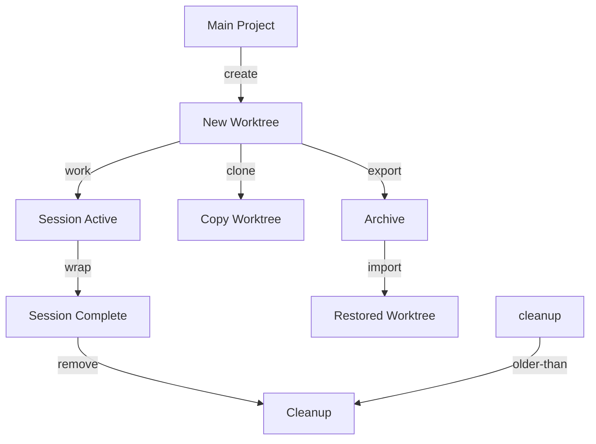

# CLI Reference: worktree

> Manage git worktrees for parallel AI coding sessions.

[Worktrees](../../reference/GLOSSARY.md#worktree) enable parallel AI coding assistant sessions with filesystem isolation. Each worktree has its own channel directory with independent sessions, rites, and state.

**Family**: worktree
**Commands**: 10
**Priority**: HIGH

---

## Commands

Commands are ordered by frequency of use: inspection first, lifecycle second, import/export last.

### ari worktree list

List all worktrees.

**Synopsis**:
```bash
ari worktree list [flags]
```

**Description**:
Lists all git worktrees associated with the repository including their session and rite status.

**Examples**:
```bash
# List worktrees
ari worktree list

# JSON output for scripting
ari worktree list -o json
```

**Output Fields**:
- `id`: Worktree identifier
- `path`: Filesystem path
- `name`: Descriptive name
- `rite`: Active rite
- `created_at`: Creation timestamp
- `has_changes`: Uncommitted changes exist
- `session_status`: Current session state

**Related Commands**:
- [`ari worktree status`](#ari-worktree-status) — Detailed status
- [`ari session list`](cli-session.md#ari-session-list) — List sessions across worktrees

---

### ari worktree status

Show worktree status.

**Synopsis**:
```bash
ari worktree status [id] [flags]
```

**Description**:
Shows detailed status for a specific worktree including git state, session state, and rite configuration. If no ID specified and you're in a worktree, shows that worktree's status.

**Arguments**:
- `id` (string, optional): Worktree ID or name

**Examples**:
```bash
# Status of current worktree
ari worktree status

# Status by ID
ari worktree status wt-20260104-143052-a1b2

# Status by name
ari worktree status feature-auth -o yaml
```

**Related Commands**:
- [`ari worktree list`](#ari-worktree-list) — Summary of all worktrees
- [`ari session status`](cli-session.md#ari-session-status) — Session-specific status

---

### ari worktree create

Create a new isolated worktree.

**Synopsis**:
```bash
ari worktree create <name> [flags]
```

**Description**:
Creates a git worktree for parallel session work. The worktree is created in `.worktrees/{id}/` with full ecosystem initialization including a fresh channel directory, rite materialization, and optional session creation.

**Arguments**:
- `name` (string, required): Descriptive name for the worktree

**Flags**:
| Flag | Type | Default | Description |
|------|------|---------|-------------|
| `--complexity` | string | `MODULE` | Session complexity: PATCH, MODULE, SYSTEM, INITIATIVE, MIGRATION |
| `--from` | string | `HEAD` | Git ref to create worktree from |
| `--rite` | string | current rite | [Rite](../../reference/GLOSSARY.md#rite) to activate in worktree |

**Examples**:
```bash
# Create worktree for feature work
ari worktree create feature-auth

# Create with specific rite
ari worktree create billing-sprint --rite=10x-dev

# Create from specific branch
ari worktree create bugfix --from=develop

# Create with high complexity
ari worktree create migration --complexity=MIGRATION
```

**What Happens**:
1. Git worktree created with detached HEAD (no branch pollution)
2. Channel directory materialized from roster
3. Rite activated via sync materialize
4. Initial session created (optional)
5. Worktree metadata saved to `.knossos/.worktree-meta.json`

**Related Commands**:
- [`ari worktree list`](#ari-worktree-list) — List worktrees
- [`ari worktree remove`](#ari-worktree-remove) — Remove worktree
- [`ari session create`](cli-session.md#ari-session-create) — Create session in worktree

---

### ari worktree remove

Remove a worktree.

**Synopsis**:
```bash
ari worktree remove <id> [flags]
```

**Description**:
Removes a git worktree and its associated metadata. Refuses to remove worktrees with uncommitted changes unless `--force` is used.

**Arguments**:
- `id` (string, required): Worktree ID or name

**Flags**:
| Flag | Type | Default | Description |
|------|------|---------|-------------|
| `-f, --force` | bool | false | Force removal even with uncommitted changes |

**Examples**:
```bash
# Remove worktree (will warn on changes)
ari worktree remove feature-auth

# Force remove
ari worktree remove wt-20260104-143052-a1b2 --force
```

**Related Commands**:
- [`ari worktree cleanup`](#ari-worktree-cleanup) — Remove stale worktrees
- [`ari session wrap`](cli-session.md#ari-session-wrap) — Complete session before removing

---

### ari worktree cleanup

Remove stale worktrees.

**Synopsis**:
```bash
ari worktree cleanup [flags]
```

**Description**:
Removes worktrees older than a threshold (default 7 days) that have no uncommitted changes. Use for regular maintenance.

**Flags**:
| Flag | Type | Default | Description |
|------|------|---------|-------------|
| `--dry-run` | bool | false | Show what would be cleaned without doing it |
| `-f, --force` | bool | false | Force cleanup even with uncommitted changes |
| `--older-than` | string | `7d` | Age threshold (e.g., 7d, 24h, 1d) |

**Examples**:
```bash
# Preview cleanup
ari worktree cleanup --dry-run

# Clean worktrees older than 3 days
ari worktree cleanup --older-than=3d

# Force cleanup of all stale worktrees
ari worktree cleanup --force
```

**Related Commands**:
- [`ari worktree remove`](#ari-worktree-remove) — Remove specific worktree
- [`ari naxos scan`](cli-naxos.md#ari-naxos-scan) — Find orphaned sessions

---

### ari worktree switch

Switch context to a worktree.

**Synopsis**:
```bash
ari worktree switch <id-or-name> [flags]
```

**Description**:
Updates session context to point to a different worktree. Note: This does NOT change your shell's working directory—use `cd` to navigate.

**Arguments**:
- `id-or-name` (string, required): Worktree ID or name

**Flags**:
| Flag | Type | Default | Description |
|------|------|---------|-------------|
| `--update-rite` | bool | false | Update ACTIVE_RITE to match worktree's rite |

**Examples**:
```bash
# Switch context
ari worktree switch feature-auth

# Switch and update rite
ari worktree switch billing-sprint --update-rite
```

**Related Commands**:
- [`ari worktree status`](#ari-worktree-status) — Check worktree state
- [`ari rite swap`](cli-rite.md#ari-rite-swap) — Change rite within worktree

---

### ari worktree sync

Sync worktree with upstream.

**Synopsis**:
```bash
ari worktree sync [id-or-name] [flags]
```

**Description**:
Checks synchronization status between worktree and upstream branch. Shows commits ahead/behind and optionally pulls changes.

**Arguments**:
- `id-or-name` (string, optional): Worktree ID or name (defaults to current)

**Flags**:
| Flag | Type | Default | Description |
|------|------|---------|-------------|
| `--pull` | bool | false | Pull changes from upstream (fast-forward only) |

**Examples**:
```bash
# Check sync status
ari worktree sync

# Check and pull
ari worktree sync feature-auth --pull
```

**Related Commands**:
- [`ari sync pull`](cli-sync.md#ari-sync-pull) — Sync configuration files

---

### ari worktree clone

Clone an existing worktree.

**Synopsis**:
```bash
ari worktree clone <source> <new-name> [flags]
```

**Description**:
Creates a new worktree by cloning an existing one. Preserves rite, complexity, and other metadata settings from the source.

**Arguments**:
- `source` (string, required): Source worktree ID or name
- `new-name` (string, required): Name for new worktree

**Flags**:
| Flag | Type | Default | Description |
|------|------|---------|-------------|
| `--copy-session` | bool | false | Copy session context from source |
| `--rite` | string | from source | Override rite |

**Examples**:
```bash
# Clone worktree
ari worktree clone feature-auth feature-auth-v2

# Clone with different rite
ari worktree clone feature-auth branch-b --rite=10x-dev

# Clone including session
ari worktree clone feature-auth backup --copy-session
```

**Related Commands**:
- [`ari worktree create`](#ari-worktree-create) — Create fresh worktree
- [`ari worktree export`](#ari-worktree-export) — Export worktree to archive

---

### ari worktree export

Export worktree to archive.

**Synopsis**:
```bash
ari worktree export <id-or-name> <target-path> [flags]
```

**Description**:
Exports a worktree to a tar.gz archive including all metadata. The archive includes all files (excluding .git), worktree metadata, and current git ref for reproducibility.

**Arguments**:
- `id-or-name` (string, required): Worktree to export
- `target-path` (string, required): Path for archive file

**Examples**:
```bash
# Export worktree
ari worktree export feature-auth ./feature-auth.tar.gz

# Export to backups directory
ari worktree export wt-20260104-143052-a1b2 ~/backups/worktree.tar.gz
```

**Related Commands**:
- [`ari worktree import`](#ari-worktree-import) — Import from archive
- [`ari worktree clone`](#ari-worktree-clone) — Clone without archive

---

### ari worktree import

Import worktree from archive.

**Synopsis**:
```bash
ari worktree import <archive-path> [flags]
```

**Description**:
Imports a worktree from a previously exported tar.gz archive. Creates new worktree with unique ID, preserving name and rite from export.

**Arguments**:
- `archive-path` (string, required): Path to archive file

**Examples**:
```bash
# Import worktree
ari worktree import ./feature-auth.tar.gz

# Import from backup
ari worktree import ~/backups/worktree.tar.gz
```

**Related Commands**:
- [`ari worktree export`](#ari-worktree-export) — Export to archive

---

## Global Flags

All worktree commands support these global flags:

| Flag | Type | Default | Description |
|------|------|---------|-------------|
| `--config` | string | `$XDG_CONFIG_HOME/ariadne/config.yaml` | Config file path |
| `-o, --output` | string | `text` | Output format: text, json, yaml |
| `-p, --project-dir` | string | auto-discovered | Project root directory |
| `-s, --session-id` | string | current session | Override session ID |
| `-v, --verbose` | bool | false | Enable verbose output |

---

## Worktree Lifecycle



---

## Parallel Session Pattern

<!-- HA-CC: "claude" is the CC CLI binary name; replace with your harness's launch command -->
```bash
# Terminal 1 (main project)
cd /path/to/roster
ari session create "Backend API"
# Working on backend...

# Terminal 2 (new worktree)
ari worktree create "frontend-sprint" --rite=10x-dev
cd .worktrees/wt-*/
claude
ari session create "Frontend Components"
# Working on frontend in isolation...

# Terminal 3 (docs worktree)
ari worktree create "docs-sprint" --rite=docs
cd .worktrees/wt-*/
claude
ari session create "API Documentation"
# Writing docs in isolation...
```

---

## See Also

- [Worktree Guide](../../guides/worktree-guide.md) — Production patterns and operations
- [Worktree Glossary Entry](../../reference/GLOSSARY.md#worktree)
