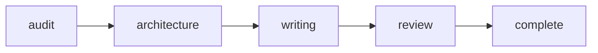

# Rite: docs

> Documentation lifecycle from audit through accuracy review.

The docs rite treats documentation as a product with its own lifecycle: audit existing state, redesign the structure, write the content, then verify technical accuracy. Each phase is a specialist handoff, not a single-agent pass. Doc-auditor does not just flag stale pages — it maps coverage against the actual codebase and identifies what's missing. Information-architect does not rearrange files — it designs taxonomy and navigation for how users actually look for information. This separates docs from ad-hoc documentation updates: the rite enforces that structure decisions precede writing decisions, so tech-writer never makes taxonomy choices, and doc-reviewer never rewrites content — only validates accuracy against the codebase.

---

## Overview

| Property | Value |
|----------|-------|
| **Name** | docs |
| **Form** | Full (multi-agent workflow) |
| **Agents** | 5 |
| **Entry Agent** | potnia |

---

## When to Use

- Auditing documentation for staleness, redundancy, or gaps after a major codebase refactoring
- Redesigning the doc taxonomy when users can't find things and the structure is the cause
- Consolidating redundant docs scattered across multiple files into authoritative single sources
- Writing new documentation for a feature that shipped without docs
- **Not for**: quick one-off page edits — invoke tech-writer directly. The full rite is for initiatives where audit findings will drive structural changes before writing begins.

---

## Agents

| Agent | Role |
|-------|------|
| **potnia** | Coordinates documentation workflow phases; gates writing on approved structure |
| **doc-auditor** | Inventories existing docs for staleness, redundancy, and coverage gaps — correlates with git history and codebase state, not timestamps alone |
| **information-architect** | Designs taxonomy, navigation, and content organization for how users actually look for information; produces content briefs for tech-writer |
| **tech-writer** | Writes from content briefs, optimizing for comprehension — explains why, not just what; never makes taxonomy decisions |
| **doc-reviewer** | Validates technical accuracy against the codebase; approves or returns with specific corrections — does not rewrite |

See agent files: `rites/docs/agents/`

---

## Workflow Phases



| Phase | Agent | Produces | Condition |
|-------|-------|----------|-----------|
| audit | doc-auditor | Audit Report | Always |
| architecture | information-architect | Doc Structure | complexity >= SECTION |
| writing | tech-writer | Documentation | Always |
| review | doc-reviewer | Review Signoff | Always |

---

## Invocation Patterns

```bash
# Quick switch to docs rite
/docs "document feature X"

# Full documentation initiative — audit drives structure drives writing
Task(potnia, "audit and restructure the rite documentation — 21 files, varying quality")

# Audit a specific directory for gaps and staleness
Task(doc-auditor, "audit docs/doctrine/rites/ — flag stale last_verified dates and missing sections")

# Write from a content brief when structure is already approved
Task(tech-writer, "write the getting started guide per content brief at .ledge/specs/getting-started-brief.md")
```

---

## Complexity Levels

| Level | Scope | Architecture Phase |
|-------|-------|-------------------|
| PAGE | Single page | Skipped |
| SECTION | Multi-page section | Required |
| DOMAIN | Entire domain | Required |
| SITE | Full documentation site | Required |

---

## Skills

- `doc-consolidation` — Consolidation workflow
- `doc-reviews` — Review templates

---

## Source

**Manifest**: `rites/docs/manifest.yaml`

---

## See Also

- [CLI: rite](../operations/cli-reference/cli-rite.md) — Rite operations
- [CLI: sync](../operations/cli-reference/cli-sync.md)
- [Rite Catalog](index.md)
