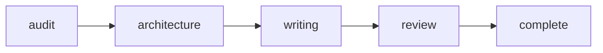

# Rite: docs

> Documentation lifecycle from audit through review.

The docs rite provides a complete workflow for documentation: Audit → Structure → Write → Review. Currently active for this sprint.

---

## Overview

| Property | Value |
|----------|-------|
| **Name** | docs |
| **Form** | Full (multi-agent workflow) |
| **Agents** | 5 |
| **Entry Agent** | potnia |

---

## When to Use

- Creating API documentation
- Writing technical guides
- Auditing documentation quality
- Restructuring documentation
- Consolidating redundant docs

---

## Agents

| Agent | Role |
|-------|------|
| **potnia** | Coordinates documentation workflow phases |
| **doc-auditor** | Audits existing documentation and identifies gaps and priorities |
| **information-architect** | Designs documentation structure aligned with user mental models |
| **tech-writer** | Writes clear, accurate technical documentation |
| **doc-reviewer** | Reviews documentation for technical accuracy and quality |

See agent files: `rites/docs/agents/`

---

## Workflow Phases



| Phase | Agent | Produces | Condition |
|-------|-------|----------|-----------|
| audit | doc-auditor | Audit Report | Always |
| architecture | information-architect | Doc Structure | complexity >= SECTION |
| writing | tech-writer | Documentation | Always |
| review | doc-reviewer | Review Signoff | Always |

---

## Invocation Patterns

```bash
# Quick switch to docs rite
/docs "document feature X"

# Orchestrator consultation
Task(orchestrator, "audit and improve documentation for Y")

# Direct agent invocation
Task(doc-auditor, "audit docs/api/")
Task(tech-writer, "write getting started guide")
```

---

## Complexity Levels

| Level | Scope | Architecture Phase |
|-------|-------|-------------------|
| PAGE | Single page | Skipped |
| SECTION | Multi-page section | Required |
| DOMAIN | Entire domain | Required |
| SITE | Full documentation site | Required |

---

## Skills

- `doc-consolidation` — Consolidation workflow
- `doc-reviews` — Review templates

---

## Source

**Manifest**: `rites/docs/manifest.yaml`

---

## See Also

- [CLI: rite](../operations/cli-reference/cli-rite.md) — Rite operations
- [Documentation Skill](/documentation)
- [Tech Writing Standards](/standards)
