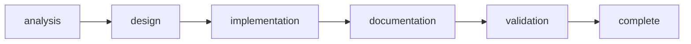

# Rite: ecosystem

> Ecosystem infrastructure lifecycle for CEM/roster changes.

The ecosystem rite is the Knossos platform's own maintenance workflow — the rite used when the platform itself breaks or needs to evolve. Its scope is narrow and deliberate: CEM schemas, sync behavior, hook wiring, roster patterns, and cross-satellite compatibility. Ecosystem-analyst does not debug application code — it reproduces infrastructure failures in test satellites, traces sync issues to specific files and lines, and produces a Gap Analysis with reproduction steps before any design begins. This rigor matters because ecosystem changes can silently corrupt satellite state across all downstream projects. Context-architect then designs solutions with explicit compatibility classifications (backward-compatible vs. breaking change) and migration paths before integration-engineer writes a single line of implementation.

---

## Overview

| Property | Value |
|----------|-------|
| **Name** | ecosystem |
| **Form** | Full (multi-agent workflow) |
| **Agents** | 6 |
| **Entry Agent** | potnia |

---

## When to Use

- Investigating sync failures where satellites lose hooks, skills, or settings after `ari sync`
- Designing new CEM schemas or hook wiring changes that need compatibility analysis
- Implementing roster infrastructure changes that affect multiple satellites
- Planning breaking migrations with runbooks and rollback procedures
- **Not for**: application feature work — use 10x-dev. Not for one-off satellite file edits — ecosystem is warranted when infrastructure changes affect the sync pipeline or cross-satellite compatibility.

---

## Agents

| Agent | Role |
|-------|------|
| **potnia** | Coordinates ecosystem infrastructure phases; requires Gap Analysis before any design work begins |
| **ecosystem-analyst** | Reproduces failures in test satellites, traces root causes to specific files and lines, classifies complexity, and produces Gap Analysis with success criteria |
| **context-architect** | Designs solutions with explicit compatibility classification (backward-compatible or breaking); specifies schemas, merge rules, and integration test matrices |
| **integration-engineer** | Implements CEM and roster changes against the approved Context Design; writes integration tests before touching production sync paths |
| **documentation-engineer** | Produces migration runbooks with step-by-step procedures and rollback instructions for satellite operators |
| **compatibility-tester** | Validates ecosystem changes across the full satellite diversity — catches regressions that homogeneous test environments miss |

See agent files: `rites/ecosystem/agents/`

---

## Workflow Phases



| Phase | Agent | Produces | Condition |
|-------|-------|----------|-----------|
| analysis | ecosystem-analyst | Gap Analysis | Always |
| design | context-architect | Context Design | complexity >= MODULE |
| implementation | integration-engineer | Implementation | Always |
| documentation | documentation-engineer | Migration Runbook | complexity >= MODULE |
| validation | compatibility-tester | Compatibility Report | Always |

---

## Invocation Patterns

```bash
# Quick switch to ecosystem
/ecosystem

# Investigate a sync failure — give analyst the symptom, not the hypothesis
Task(ecosystem-analyst, "investigate why satellite hooks are lost after running ari sync — reproduce in test satellite first")

# Design solution after Gap Analysis identifies root cause
Task(context-architect, "design solution for array merge issue in GAP-settings-merge.md — classify as backward-compatible or breaking")

# Validate the change across diverse satellites before merging
Task(compatibility-tester, "validate CEM schema change across all satellites in ~/code/acme-*")
```

---

## Source

**Manifest**: `rites/ecosystem/manifest.yaml`

---

## See Also

- [CLI: rite](../operations/cli-reference/cli-rite.md)
- [CLI: sync](../operations/cli-reference/cli-sync.md)
- [SOURCE vs PROJECTION](../philosophy/mythology-concordance.md)
