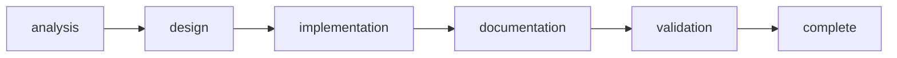

# Rite: ecosystem

> Ecosystem infrastructure lifecycle for CEM/roster changes.

The ecosystem rite provides workflows for maintaining and evolving the Knossos platform infrastructure including CEM schemas, roster patterns, and cross-project compatibility.

---

## Overview

| Property | Value |
|----------|-------|
| **Name** | ecosystem |
| **Form** | Full (multi-agent workflow) |
| **Agents** | 6 |
| **Entry Agent** | potnia |

---

## When to Use

- Tracing CEM/roster problems to root causes
- Designing context solutions and schemas
- Implementing roster infrastructure changes
- Planning migrations across satellites
- Validating cross-project compatibility

---

## Agents

| Agent | Role |
|-------|------|
| **potnia** | Coordinates ecosystem infrastructure phases |
| **ecosystem-analyst** | Traces CEM/roster problems to root causes and produces gap analysis |
| **context-architect** | Designs context solutions, schemas, and ecosystem patterns |
| **integration-engineer** | Implements CEM and roster changes with integration tests |
| **documentation-engineer** | Documents migrations and creates runbooks |
| **compatibility-tester** | Validates ecosystem changes across satellite diversity |

See agent files: `rites/ecosystem/agents/`

---

## Workflow Phases



| Phase | Agent | Produces | Condition |
|-------|-------|----------|-----------|
| analysis | ecosystem-analyst | Gap Analysis | Always |
| design | context-architect | Context Design | complexity >= MODULE |
| implementation | integration-engineer | Implementation | Always |
| documentation | documentation-engineer | Migration Runbook | complexity >= MODULE |
| validation | compatibility-tester | Compatibility Report | Always |

---

## Invocation Patterns

```bash
# Quick switch to ecosystem
/ecosystem

# Analyze problem
Task(ecosystem-analyst, "trace materialization failure to root cause")

# Design solution
Task(context-architect, "design new rite composition pattern")

# Validate across satellites
Task(compatibility-tester, "validate CEM schema change across all satellites")
```

---

## Source

**Manifest**: `rites/ecosystem/manifest.yaml`

---

## See Also

- [CLI: rite](../operations/cli-reference/cli-rite.md)
- [CLI: sync](../operations/cli-reference/cli-sync.md)
- [SOURCE vs PROJECTION](../philosophy/mythology-concordance.md)
