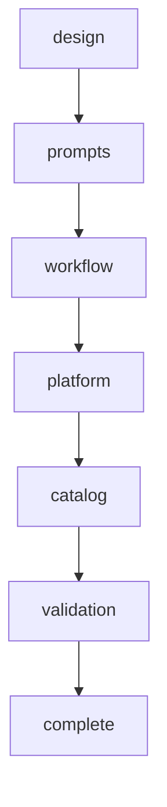
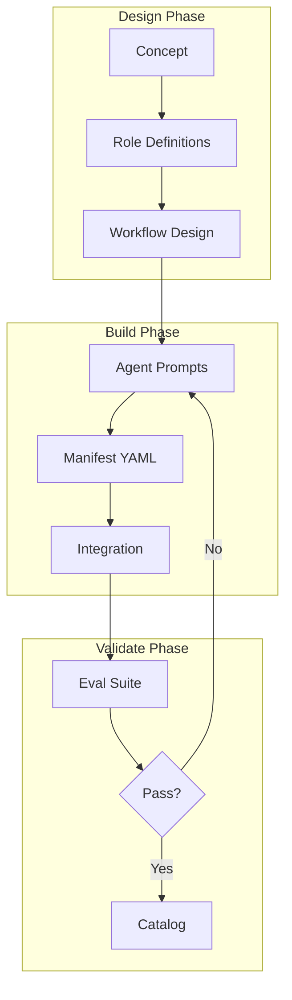

# Rite: forge

> Agent team creation lifecycle for platform development.

The forge rite is the meta-rite for building agents, tools, and platform infrastructure. Named after [Daedalus](../reference/GLOSSARY.md#daedalus), the builder of the labyrinth.

---

## Overview

| Property | Value |
|----------|-------|
| **Name** | forge |
| **Form** | Full (multi-agent workflow) |
| **Agents** | 7 |
| **Entry Agent** | orchestrator |

---

## When to Use

- Creating new agent teams
- Building platform tools
- Designing new rites
- Extending roster infrastructure
- Evaluating agent performance

---

## Agents

| Agent | Role |
|-------|------|
| **orchestrator** | Coordinates agent team creation phases |
| **agent-designer** | Designs agent team concepts and role specifications |
| **prompt-architect** | Creates agent prompt files and system instructions |
| **workflow-engineer** | Configures workflow phases and transitions |
| **platform-engineer** | Integrates agents into roster ecosystem |
| **agent-curator** | Updates knowledge base and documentation |
| **eval-specialist** | Evaluates and validates agent team readiness |

See agent files: `/roster/rites/forge/agents/`

---

## Workflow Phases



| Phase | Agent | Produces | Condition |
|-------|-------|----------|-----------|
| design | agent-designer | Rite Spec | Always |
| prompts | prompt-architect | Agent Files | Always |
| workflow | workflow-engineer | Workflow Config | Always |
| platform | platform-engineer | Roster Integration | complexity >= MODULE |
| catalog | agent-curator | Knowledge Update | complexity >= MODULE |
| validation | eval-specialist | Eval Report | Always |

---

## Architecture

The forge creates new rites following this structure:

```
rites/{new-rite}/
├── manifest.yaml          # Rite composition
├── agents/                # Agent prompt files
│   ├── orchestrator.md
│   └── {specialists}.md
├── skills/                # Rite-specific skills
└── hooks/                 # Rite-specific hooks
```



---

## Invocation Patterns

```bash
# Quick switch to forge
/forge

# Create new rite
Task(orchestrator, "create new rite for code review workflow")

# Design phase only
Task(agent-designer, "design agent team for security auditing")

# Evaluate existing rite
Task(eval-specialist, "evaluate 10x-dev rite performance")
```

---

## Complexity Levels

| Level | Scope | Platform Phase |
|-------|-------|---------------|
| SIMPLE | Skills-only rite | Skipped |
| STANDARD | Single-agent rite | Skipped |
| FULL | Multi-agent rite | Required |
| ECOSYSTEM | Cross-rite integration | Required |

---

## Source

**Manifest**: `/roster/rites/forge/manifest.yaml`

---

## See Also

- [Daedalus Glossary Entry](../reference/GLOSSARY.md#daedalus)
- [Rite System Overview](../philosophy/knossos-doctrine.md)
- [Orchestrator Templates](/orchestrator-templates)
