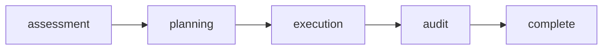

# Rite: hygiene

> Code quality lifecycle for smell detection, planning, and cleanup.

The hygiene rite is a detect-plan-execute-verify cycle for code quality cleanup: dead code, DRY violations, complexity hotspots, naming inconsistencies, and boundary drift. It does not fix smells opportunistically — code-smeller produces a prioritized smell report first, then architect-enforcer evaluates which findings are local style issues versus systemic boundary violations before the janitor touches a single file. This sequencing is the rite's key mechanism: a smell that looks like a DRY violation may actually be architectural drift that needs a different fix than simple extraction. Hygiene differs from slop-chop (which hunts AI-specific pathologies) and debt-triage (which schedules work across sprints) — hygiene detects, plans, and executes cleanup within a single workflow.

---

## Overview

| Property | Value |
|----------|-------|
| **Name** | hygiene |
| **Form** | Full (multi-agent workflow) |
| **Agents** | 5 |
| **Entry Agent** | potnia |

---

## When to Use

- Running a systematic smell detection pass before a major refactoring or release
- Diagnosing a module that "feels messy" with file-level evidence and severity scores
- Executing a cleanup sprint with architectural guidance on what to fix and in what order
- Auditing the results of a cleanup to verify improvements against the original smell report
- **Not for**: AI-generated code quality issues — use slop-chop. Not for scheduling multi-sprint debt paydown — use debt-triage. Hygiene is single-workflow, code-focused cleanup.

---

## Agents

| Agent | Role |
|-------|------|
| **potnia** | Coordinates code hygiene phases; gates execution on an approved refactoring plan |
| **code-smeller** | Detects dead code, DRY violations, complexity hotspots, and inconsistencies with file-level evidence; ranks findings by cleanup ROI, not just severity |
| **architect-enforcer** | Classifies each smell as local style or systemic boundary violation; produces before/after contracts and sequences refactoring work by risk |
| **janitor** | Executes cleanup against the approved plan; applies the architect's contracts, does not improvise scope |
| **audit-lead** | Verifies cleanup against the original smell report; confirms improvements, catches regressions, and provides signoff |

See agent files: `rites/hygiene/agents/`

---

## Workflow Phases



| Phase | Agent | Produces | Condition |
|-------|-------|----------|-----------|
| assessment | code-smeller | Smell Report | Always |
| planning | architect-enforcer | Refactor Plan | Always |
| execution | janitor | Commits | Always |
| audit | audit-lead | Audit Signoff | Always |

---

## Invocation Patterns

```bash
# Quick switch to hygiene
/hygiene

# Detect smells in a specific directory with ROI ranking
Task(code-smeller, "scan internal/ for dead code, DRY violations, and complexity hotspots — rank by cleanup ROI")

# Evaluate smells through architectural lens after smell report is complete
Task(architect-enforcer, "evaluate smell report findings — classify local vs boundary violations and sequence by risk")

# Execute cleanup against the approved plan
Task(janitor, "execute refactoring plan from architect-enforcer — apply before/after contracts exactly")
```

---

## Skills

- `hygiene-ref` — Workflow reference

---

## Source

**Manifest**: `rites/hygiene/manifest.yaml`

---

## See Also

- [CLI: rite](../operations/cli-reference/cli-rite.md)
- `/smell-detection` skill — Code smell detection patterns
