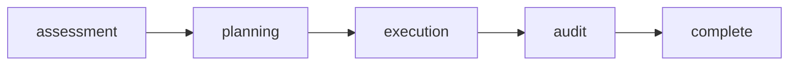

# Rite: hygiene

> Code quality lifecycle for smell detection, planning, and cleanup.

The hygiene rite provides workflows for maintaining code quality through systematic smell detection and refactoring.

---

## Overview

| Property | Value |
|----------|-------|
| **Name** | hygiene |
| **Form** | Full (multi-agent workflow) |
| **Agents** | 5 |
| **Entry Agent** | pythia |

---

## When to Use

- Detecting code smells
- Planning refactoring efforts
- Executing code cleanup
- Auditing code quality improvements
- Reducing technical debt

---

## Agents

| Agent | Role |
|-------|------|
| **pythia** | Coordinates code hygiene initiative phases |
| **code-smeller** | Detects code smells and quality issues across codebase |
| **architect-enforcer** | Plans refactoring approach and enforces architecture standards |
| **janitor** | Executes code cleanup and improvements |
| **audit-lead** | Audits cleanup results and provides quality signoff |

See agent files: `rites/hygiene/agents/`

---

## Workflow Phases



| Phase | Agent | Produces | Condition |
|-------|-------|----------|-----------|
| assessment | code-smeller | Smell Report | Always |
| planning | architect-enforcer | Refactor Plan | Always |
| execution | janitor | Commits | Always |
| audit | audit-lead | Audit Signoff | Always |

---

## Invocation Patterns

```bash
# Quick switch to hygiene
/hygiene

# Detect smells in specific area
Task(code-smeller, "detect smells in src/api/")

# Plan refactoring
Task(architect-enforcer, "plan refactoring for user module")
```

---

## Skills

- `hygiene-ref` — Workflow reference

---

## Source

**Manifest**: `rites/hygiene/manifest.yaml`

---

## See Also

- [CLI: rite](../operations/cli-reference/cli-rite.md)
- [Smell Detection Skill](/smell-detection)
