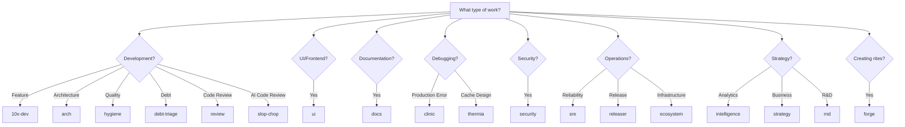

# Rite Catalog Index

> Comprehensive catalog of all rites in the Knossos ecosystem.

A **rite** is a practice bundle that provides specialized workflows for different types of work. Each rite defines agents, phases, and handoff protocols optimized for its domain.

---

## Quick Reference

| Rite | Form | Agents | Entry | Purpose |
|------|------|--------|-------|---------|
| [10x-dev](10x-dev.md) | Full | 5 | potnia | Full development lifecycle |
| [arch](arch.md) | Full | 5 | potnia | Architecture assessment |
| [clinic](clinic.md) | Full | 5 | potnia | Production error investigation lifecycle |
| [docs](docs.md) | Full | 5 | potnia | Documentation workflow |
| [forge](forge.md) | Meta | 8 | potnia | Rite creation |
| [hygiene](hygiene.md) | Full | 5 | potnia | Code quality lifecycle |
| [debt-triage](debt-triage.md) | Full | 4 | potnia | Technical debt management |
| [releaser](releaser.md) | Full | 6 | potnia | Multi-repo release orchestration |
| [review](review.md) | Full | 4 | potnia | Language-agnostic code review |
| [security](security.md) | Full | 5 | potnia | Security assessment lifecycle |
| [sre](sre.md) | Full | 5 | potnia | Reliability engineering |
| [intelligence](intelligence.md) | Full | 5 | potnia | Product analytics |
| [strategy](strategy.md) | Full | 5 | potnia | Business strategy |
| [thermia](thermia.md) | Full | 5 | potnia | Cache architecture consultation |
| [rnd](rnd.md) | Full | 6 | potnia | Technology exploration |
| [ecosystem](ecosystem.md) | Full | 6 | potnia | Platform infrastructure |
| [slop-chop](slop-chop.md) | Full | 6 | potnia | AI code quality gate |
| [ui](ui.md) | Full | 9 | potnia | UI/UX development lifecycle |
| [shared](shared.md) | Cross-rite | 1 | — | Cross-rite resources (theoros) |

---

## Rite Forms

### Full Rites
Multi-agent workflows with distinct phases and handoff protocols. These rites follow the orchestrator pattern where work flows through specialized agents.

**Characteristics:**
- Entry via orchestrator agent
- Phase-based progression
- Formal handoffs between agents
- Produces artifacts at each phase

### Meta Rites
Special rites that operate on the rite system itself. The **forge** rite is the only meta-rite, used to create new rites.

---

## By Use Case

### Development & Quality
- [10x-dev](10x-dev.md) — Full feature development from PRD to QA
- [arch](arch.md) — Architecture assessment and remediation
- [hygiene](hygiene.md) — Code quality audits and improvements
- [debt-triage](debt-triage.md) — Technical debt assessment and remediation
- [review](review.md) — Language-agnostic code review with health grading
- [slop-chop](slop-chop.md) — AI code quality gate; hallucination detection and temporal debt audit

### UI & Frontend
- [ui](ui.md) — UI/UX development lifecycle with posture-aware routing

### Documentation & Knowledge
- [docs](docs.md) — Documentation creation and maintenance
- [forge](forge.md) — Creating new rites (meta-rite)

### Debugging & Operations
- [clinic](clinic.md) — Production error investigation and treatment planning
- [thermia](thermia.md) — Cache architecture consultation and observability design

### Security & Reliability
- [security](security.md) — Security assessments and threat modeling
- [sre](sre.md) — Observability, incidents, and resilience

### Release Engineering
- [releaser](releaser.md) — Multi-repo release orchestration across package ecosystems

### Analytics & Strategy
- [intelligence](intelligence.md) — Product analytics and experimentation
- [strategy](strategy.md) — Market research and strategic planning

### Innovation & Infrastructure
- [rnd](rnd.md) — Technology exploration and prototyping
- [ecosystem](ecosystem.md) — CEM/roster infrastructure changes

---

## Rite Selection



---

## Invocation Patterns

### Quick Switch
```bash
# Switch to a rite
/10x          # Development
/arch         # Architecture assessment
/docs         # Documentation
/hygiene      # Code quality
/debt         # Technical debt
/review       # Code review
/ui           # UI/UX development
/clinic       # Production error investigation
/thermia      # Cache architecture consultation
/security     # Security
/sre          # Reliability
/releaser     # Release orchestration
/intelligence # Analytics
/strategy     # Business strategy
/rnd          # R&D
/ecosystem    # Infrastructure
/forge        # Meta-rite
/slop-chop    # AI code quality gate
```

### CLI Commands
```bash
# List available rites
ari rite pantheon

# View current rite
ari rite current

# Get rite information
ari rite info 10x-dev

# Invoke a rite
ari rite invoke docs

# Release current rite
ari rite release
```

### Within Sessions
```bash
# Start task with specific rite
/task "implement user auth" --rite 10x-dev

# Sprint with rite context
/sprint "documentation overhaul" --rite docs
```

---

## Common Workflows

### Feature Development
1. `/10x` — Switch to 10x-dev rite
2. `/task "feature name"` — Initialize task
3. Orchestrator routes through PRD → TDD → Implementation → QA

### Documentation Sprint
1. `/docs` — Switch to docs rite
2. `/sprint "doc initiative"` — Initialize sprint
3. Auditor → Architect → Writer → Reviewer flow

### Security Review
1. `/security` — Switch to security rite
2. `/task "security audit"` — Initialize task
3. Threat modeling → Assessment → Remediation → Validation

---

## Rite Anatomy

Each rite is defined by a manifest at `rites/{rite-name}/manifest.yaml`:

```yaml
name: example-rite
form: full
entry_agent: potnia

agents:
  - name: orchestrator
    role: Coordinates workflow phases
  - name: specialist-1
    role: Domain expertise
  # ...

phases:
  - name: analysis
    agent: specialist-1
    produces: Analysis Report
  - name: implementation
    agent: specialist-2
    produces: Implementation
  # ...

skills:
  - skill-name-ref
```

---

## See Also

- [CLI: rite](../operations/cli-reference/cli-rite.md) — Rite CLI commands
- [The Forge](forge.md) — Creating new rites
- [Knossos Doctrine - Rites](../philosophy/knossos-doctrine.md#iv-the-rites)
- [Knossos Doctrine - Rites](../philosophy/knossos-doctrine.md) — Rite philosophy and design
