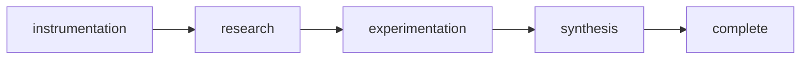

# Rite: intelligence

> Product analytics lifecycle for instrumentation, research, experimentation, and insights.

The intelligence rite provides workflows for data-driven decision making through analytics, user research, and experimentation.

---

## Overview

| Property | Value |
|----------|-------|
| **Name** | intelligence |
| **Form** | Full (multi-agent workflow) |
| **Agents** | 5 |
| **Entry Agent** | potnia |

---

## When to Use

- Designing event tracking
- Conducting user research
- Running experiments
- Synthesizing insights
- Data-driven product decisions

---

## Agents

| Agent | Role |
|-------|------|
| **potnia** | Coordinates analytics and research initiative phases |
| **analytics-engineer** | Designs tracking plans and implements event instrumentation |
| **user-researcher** | Conducts user research and extracts qualitative insights |
| **experimentation-lead** | Designs experiments with proper statistical methodology |
| **insights-analyst** | Synthesizes quantitative and qualitative data into insights |

See agent files: `rites/intelligence/agents/`

---

## Workflow Phases



| Phase | Agent | Produces | Condition |
|-------|-------|----------|-----------|
| instrumentation | analytics-engineer | Tracking Plan | Always |
| research | user-researcher | Research Findings | complexity >= FEATURE |
| experimentation | experimentation-lead | Experiment Design | Always |
| synthesis | insights-analyst | Insights Report | Always |

---

## Invocation Patterns

```bash
# Quick switch to intelligence
/intelligence

# Design tracking
Task(analytics-engineer, "design tracking for checkout funnel")

# User research
Task(user-researcher, "conduct user research on onboarding")

# Experiment design
Task(experimentation-lead, "design A/B test for new pricing")
```

---

## Skills

- `doc-intelligence` — Intelligence documentation
- `intelligence-ref` — Workflow reference

---

## Source

**Manifest**: `rites/intelligence/manifest.yaml`

---

## See Also

- [CLI: rite](../operations/cli-reference/cli-rite.md)
