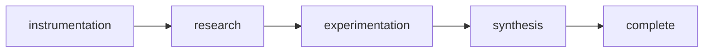

# Rite: intelligence

> Product analytics lifecycle for instrumentation, research, experimentation, and insights.

The intelligence rite is an evidence-to-decision pipeline: instrument, observe, experiment, decide. It does not start with gut feelings about what to build — analytics-engineer designs the tracking plan and event taxonomy first, so user-researcher and experimentation-lead work from reliable data rather than reconstructed history. The rite's defining moment is insights-analyst's output: not raw data, but a GO/NO-GO recommendation with confidence ratings and impact projections that stakeholders can act on without interpretation. This separates intelligence from ad-hoc analytics work: the rite enforces statistical rigor at the experimentation phase, so the synthesis phase produces numbers you can defend, not numbers you have to explain.

---

## Overview

| Property | Value |
|----------|-------|
| **Name** | intelligence |
| **Form** | Full (multi-agent workflow) |
| **Agents** | 5 |
| **Entry Agent** | potnia |

---

## When to Use

- Instrumenting a new feature with a tracking plan before it ships, not after
- Auditing unreliable or inconsistent analytics where event naming drifted over time
- Designing experiments with proper statistical methodology — sample size, duration, segment definitions
- Synthesizing completed experiment results into a GO/NO-GO recommendation with confidence ratings
- **Not for**: competitive market research or strategic planning — use strategy or rnd for those. Intelligence is internal product analytics and user behavior, not external market analysis.

---

## Agents

| Agent | Role |
|-------|------|
| **potnia** | Coordinates analytics and research phases; gates synthesis on completed experiment data |
| **analytics-engineer** | Designs event taxonomies and tracking plans with validation rules; audits existing analytics for naming drift and coverage gaps |
| **user-researcher** | Extracts qualitative insights from user behavior; surfaces segment-level patterns that quantitative data misses |
| **experimentation-lead** | Designs statistically sound A/B tests with sample size calculations, duration estimates, and segment definitions |
| **insights-analyst** | Produces GO/NO-GO recommendations with impact projections and confidence ratings — transforms data into decisions, not reports |

See agent files: `rites/intelligence/agents/`

---

## Workflow Phases



| Phase | Agent | Produces | Condition |
|-------|-------|----------|-----------|
| instrumentation | analytics-engineer | Tracking Plan | Always |
| research | user-researcher | Research Findings | complexity >= FEATURE |
| experimentation | experimentation-lead | Experiment Design | Always |
| synthesis | insights-analyst | Insights Report | Always |

---

## Invocation Patterns

```bash
# Quick switch to intelligence
/intelligence

# Design a tracking plan before a feature ships
Task(analytics-engineer, "design event taxonomy and tracking plan for checkout funnel — include validation rules and QA checklist")

# Conduct user research on a specific behavior
Task(user-researcher, "analyze onboarding drop-off at step 3 — what are users doing and why do they leave?")

# Design an experiment with statistical rigor
Task(experimentation-lead, "design A/B test for new pricing page — calculate required sample size and minimum detectable effect")

# Synthesize results into a decision after experiment completes
Task(insights-analyst, "checkout A/B test finished — 14 days of data, interpret results and deliver GO/NO-GO recommendation")
```

---

## Skills

- `doc-intelligence` — Intelligence documentation
- `intelligence-ref` — Workflow reference

---

## Source

**Manifest**: `rites/intelligence/manifest.yaml`

---

## See Also

- [CLI: rite](../operations/cli-reference/cli-rite.md)
