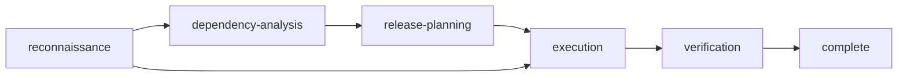

# Rite: releaser

> Multi-repo release orchestration engine.

The releaser rite coordinates releases across multiple repositories: discovering repos and their state, resolving inter-repo dependencies, planning a phased execution order, executing the release (publish, version bump, PR creation), and monitoring CI pipelines to verify success. It handles everything from a single-repo patch to a full platform release spanning many repos and package ecosystems.

---

## Overview

| Property | Value |
|----------|-------|
| **Name** | releaser |
| **Form** | Full (multi-agent workflow) |
| **Agents** | 6 |
| **Entry Agent** | potnia |

---

## When to Use

- Releasing a single package and watching CI pass
- Publishing an SDK and bumping dependent consumer versions across repos
- Coordinating a full platform release across all matching repos
- Diagnosing CI failures after a release push

---

## Agents

| Agent | Role |
|-------|------|
| **potnia** | Coordinates release phases, gates complexity, manages DAG-branch failure halting |
| **cartographer** | Discovers repos via glob patterns, maps git state, identifies package ecosystems and available commands |
| **dependency-resolver** | Builds cross-repo dependency DAG, detects version mismatches, calculates blast radius |
| **release-planner** | Creates phased execution plan with parallel groups, rollback boundaries, and CI time estimates |
| **release-executor** | Executes the release plan — publishes packages, bumps versions, pushes code, creates PRs |
| **pipeline-monitor** | Monitors CI pipelines via gh CLI, reports green/red matrix, diagnoses failures |

See agent files: `rites/releaser/agents/`

---

## Workflow Phases



| Phase | Agent | Produces | Condition |
|-------|-------|----------|-----------|
| reconnaissance | cartographer | platform-state-map | Always |
| dependency-analysis | dependency-resolver | dependency-graph | complexity >= RELEASE |
| release-planning | release-planner | release-plan | complexity >= RELEASE |
| execution | release-executor | execution-ledger | Always |
| verification | pipeline-monitor | verification-report | Always |

### Complexity Levels

| Level | Scope | Phases |
|-------|-------|--------|
| **PATCH** | Single repo push + CI watch (auto-escalates to RELEASE if dependents detected) | reconnaissance → execution → verification |
| **RELEASE** | SDK publish + consumer version bumps across dependent repos | All 5 phases |
| **PLATFORM** | Full platform release — all matching repos, full transitive DAG, extended CI monitoring | All 5 phases |

---

## Invocation Patterns

```bash
# Quick switch to releaser
/releaser

# Start a release
/release

# Discover and map repos
Task(cartographer, "scan ~/code/acme-* and map git state and package ecosystems")

# Build dependency graph
Task(dependency-resolver, "build cross-repo dependency graph from platform state map")

# Execute release plan
Task(release-executor, "execute the release plan")

# Monitor CI
Task(pipeline-monitor, "monitor CI pipelines and report green/red status")
```

---

## Skills

- `releaser-ref` — Release workflow reference
- `commit-conventions` — Conventional commit format for release commits

---

## Source

**Manifest**: `rites/releaser/manifest.yaml`

---

## See Also

- [CLI: rite](../operations/cli-reference/cli-rite.md)
- [CLI: sync](../operations/cli-reference/cli-sync.md)
- [Rite Catalog](index.md)
