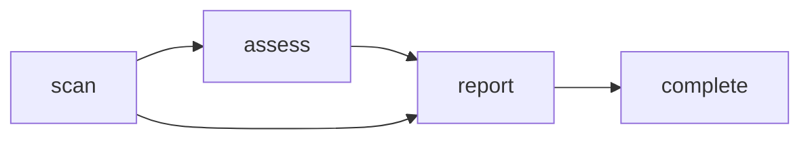

# Rite: review

> Language-agnostic code review lifecycle.

The review rite is the simplest multi-phase orchestrated workflow in Knossos. It works on any codebase regardless of language. Three specialists move through scan → assess → report: the signal-sifter reads structure, the pattern-profiler connects dots across signals, and the case-reporter writes the definitive health report. The rite supports a QUICK triage mode that skips the profiling phase.

---

## Overview

| Property | Value |
|----------|-------|
| **Name** | review |
| **Form** | Full (multi-agent workflow) |
| **Agents** | 4 |
| **Entry Agent** | potnia |

---

## When to Use

- Full repository health review with severity grading
- Focused triage of specific files or a module
- Producing a case file for an architectural decision
- Identifying patterns and systemic issues across a codebase

---

## Agents

| Agent | Role |
|-------|------|
| **potnia** | Coordinates code review phases, gates complexity, manages back-routes |
| **signal-sifter** | Reads codebase structure and sifts signal from noise using language-agnostic heuristics |
| **pattern-profiler** | Connects dots across signals, builds severity profile and health grades |
| **case-reporter** | Writes the definitive case file with health report card and routing recommendations |

See agent files: `rites/review/agents/`

---

## Workflow Phases



| Phase | Agent | Produces | Condition |
|-------|-------|----------|-----------|
| scan | signal-sifter | scan-findings | Always |
| assess | pattern-profiler | assessment | complexity = FULL |
| report | case-reporter | review-report | Always |

### Complexity Levels

| Level | Scope | Phases |
|-------|-------|--------|
| **QUICK** | Focused triage of specific files or module | scan → report |
| **FULL** | Complete repository review with health grading | scan → assess → report |

---

## Invocation Patterns

```bash
# Quick switch to review
/review

# Scan a specific module
Task(signal-sifter, "scan src/api/ for structural signals")

# Profile patterns across findings
Task(pattern-profiler, "profile patterns across scan findings and assign severity grades")

# Write the case file
Task(case-reporter, "write the definitive review report with health report card")
```

---

## Skills

- `review-ref` — Code review workflow reference

---

## Source

**Manifest**: `rites/review/manifest.yaml`

---

## See Also

- [CLI: rite](../operations/cli-reference/cli-rite.md)
- [CLI: sync](../operations/cli-reference/cli-sync.md)
- [Rite Catalog](index.md)
