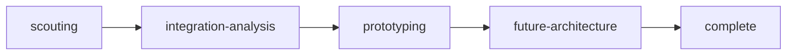

# Rite: rnd

> Technology exploration lifecycle for scouting, prototyping, and future architecture.

The rnd rite is structured exploration with a deliberate escape hatch to production. Technology-scout produces adopt/trial/assess/hold/avoid verdicts on emerging technologies before any integration work begins — this prevents the common failure mode of prototyping first and evaluating fit afterward. Prototype-engineer explicitly builds with shortcuts: the goal is feasibility signal, not production code. Moonshot-architect then stress-tests current systems against 2+ year scenarios — 100x scale, regulatory inversion, paradigm shifts — and designs reversible migration paths with observable trigger signals. The tech-transfer agent closes the loop between R&D findings and production readiness, which most exploration workflows never formally do.

---

## Overview

| Property | Value |
|----------|-------|
| **Name** | rnd |
| **Form** | Full (multi-agent workflow) |
| **Agents** | 6 |
| **Entry Agent** | potnia |

---

## When to Use

- Evaluating a new technology (database, framework, service) before committing engineering time — get a verdict before you prototype
- Making build vs. buy decisions with structured comparison matrices and explicit criteria
- Validating a risky technical approach with a time-boxed prototype that has deliberate shortcuts
- Planning architecture decisions for the 2+ year horizon, stress-tested against realistic future scenarios
- **Not for**: production feature implementation — use 10x-dev. Not for evaluating a competitor's product strategy — use strategy or intelligence. rnd targets technology fit and long-term architecture, not business decisions.

---

## Agents

| Agent | Role |
|-------|------|
| **potnia** | Coordinates technology exploration phases; routes to prototyping only after scout verdict recommends trial or adopt |
| **technology-scout** | Evaluates technology maturity, risk, and organizational fit; produces adopt/trial/assess/hold/avoid verdicts with evidence — not just recommendations |
| **integration-researcher** | Maps integration dependencies, assesses compatibility with existing systems, and estimates integration complexity |
| **prototype-engineer** | Builds feasibility prototypes with explicit shortcuts — the goal is signal, not production code; documents what was deliberately skipped |
| **moonshot-architect** | Stress-tests current architecture against 2+ year scenarios; designs reversible migration paths with observable trigger signals |
| **tech-transfer** | Bridges R&D findings to production readiness — produces handoff artifacts that 10x-dev can build from |

See agent files: `rites/rnd/agents/`

---

## Workflow Phases



| Phase | Agent | Produces | Condition |
|-------|-------|----------|-----------|
| scouting | technology-scout | Tech Assessment | Always |
| integration-analysis | integration-researcher | Integration Map | complexity >= EVALUATION |
| prototyping | prototype-engineer | Prototype | Always |
| future-architecture | moonshot-architect | Moonshot Plan | Always |

---

## Invocation Patterns

```bash
# Quick switch to R&D
/rnd

# Evaluate a technology before committing to it — scout produces a verdict
Task(technology-scout, "evaluate Pinecone vs Weaviate vs building our own vector search — produce adopt/trial/assess recommendation with evidence")

# Build a feasibility prototype after scout recommends trial
Task(prototype-engineer, "prototype ML-powered search using Weaviate — validate latency at 1M document scale, shortcuts are OK")

# Plan long-term architecture for a technology that prototyped successfully
Task(moonshot-architect, "ML search prototype validated — design architecture that survives 100x scale and regulatory data-residency requirements")
```

---

## Source

**Manifest**: `rites/rnd/manifest.yaml`

---

## See Also

- [CLI: rite](../operations/cli-reference/cli-rite.md)
- `/spike` skill — Spike and exploration workflow patterns
