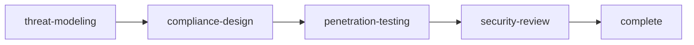

# Rite: security

> Security assessment lifecycle for threat modeling, compliance, and penetration testing.

The security rite provides workflows for comprehensive security assessment including threat modeling, compliance mapping, and vulnerability testing.

---

## Overview

| Property | Value |
|----------|-------|
| **Name** | security |
| **Form** | Full (multi-agent workflow) |
| **Agents** | 5 |
| **Entry Agent** | potnia |

---

## When to Use

- Modeling threats and attack vectors
- Mapping compliance requirements
- Conducting penetration tests
- Security review before deployment
- Vulnerability assessment

---

## Agents

| Agent | Role |
|-------|------|
| **potnia** | Coordinates security initiative phases |
| **threat-modeler** | Models threats and identifies security risks and attack vectors |
| **compliance-architect** | Maps compliance requirements and designs control frameworks |
| **penetration-tester** | Executes penetration tests and documents vulnerabilities |
| **security-reviewer** | Performs final security review and grants deployment approval |

See agent files: `rites/security/agents/`

---

## Workflow Phases



| Phase | Agent | Produces | Condition |
|-------|-------|----------|-----------|
| threat-modeling | threat-modeler | Threat Model | Always |
| compliance-design | compliance-architect | Compliance Requirements | complexity >= FEATURE |
| penetration-testing | penetration-tester | Pentest Report | Always |
| security-review | security-reviewer | Security Signoff | Always |

---

## Invocation Patterns

```bash
# Quick switch to security
/security

# Threat modeling
Task(threat-modeler, "model threats for API authentication")

# Compliance review
Task(compliance-architect, "map GDPR requirements")

# Pentest specific area
Task(penetration-tester, "test authentication endpoints")
```

---

## Skills

- `doc-security` — Security documentation
- `security-ref` — Workflow reference

---

## Source

**Manifest**: `rites/security/manifest.yaml`

---

## See Also

- [CLI: rite](../operations/cli-reference/cli-rite.md)
- [Security Standards](/standards)
