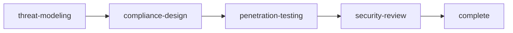

# Rite: security

> Security assessment lifecycle for threat modeling, compliance, and penetration testing.

The security rite is a pre-ship security assessment pipeline that treats threats as hypotheses to be tested, not checklists to be completed. Threat-modeler applies STRIDE/DREAD methodology to map attack surfaces and enumerate kill chains before code is reviewed — identifying which threats to test, not just which tests to run. Compliance-architect translates regulatory requirements into control frameworks, mapping each control to specific implementation decisions rather than producing abstract policy documents. The workflow culminates in a security-reviewer who issues a merge decision — approve, request-changes, or reject — with evidence chains for every finding, not advisory comments that developers can ignore.

---

## Overview

| Property | Value |
|----------|-------|
| **Name** | security |
| **Form** | Full (multi-agent workflow) |
| **Agents** | 5 |
| **Entry Agent** | potnia |

---

## When to Use

- Threat-modeling a new feature that handles authentication, PII, or external input before it ships
- Mapping compliance requirements (GDPR, SOC 2, HIPAA) to specific implementation controls
- Running penetration tests against authentication endpoints, API surfaces, or data access paths
- Getting a security signoff (approve/reject with evidence) before merging a security-sensitive PR
- **Not for**: runtime incident response — use clinic or sre. Not for dependency vulnerability scanning as a CI step — the rite is for deliberate, human-directed security assessment workflows.

---

## Agents

| Agent | Role |
|-------|------|
| **potnia** | Coordinates security assessment phases; gates penetration testing on a completed threat model |
| **threat-modeler** | Maps attack surfaces and trust boundaries using STRIDE; scores threats with DREAD and produces prioritized mitigations — thinks like an attacker before testing begins |
| **compliance-architect** | Translates regulatory requirements into specific control frameworks; maps each control to implementation decisions, not abstract policies |
| **penetration-tester** | Executes targeted tests against the attack surface identified by threat-modeler; documents vulnerabilities with proof-of-concept evidence |
| **security-reviewer** | Issues merge decisions (approve/request-changes/reject) with evidence chains for every finding — no advisory framing, no hedging |

See agent files: `rites/security/agents/`

---

## Workflow Phases



| Phase | Agent | Produces | Condition |
|-------|-------|----------|-----------|
| threat-modeling | threat-modeler | Threat Model | Always |
| compliance-design | compliance-architect | Compliance Requirements | complexity >= FEATURE |
| penetration-testing | penetration-tester | Pentest Report | Always |
| security-review | security-reviewer | Security Signoff | Always |

---

## Invocation Patterns

```bash
# Quick switch to security
/security

# Threat-model a new feature before implementation
Task(threat-modeler, "map attack surface for new payment API — apply STRIDE to each component, score with DREAD, produce prioritized mitigations")

# Map compliance requirements to specific controls
Task(compliance-architect, "map GDPR requirements to our data handling implementation — identify gaps between policy and code")

# Pentest a specific surface after threat model is complete
Task(penetration-tester, "test authentication endpoints per threat model — focus on token refresh flow and session invalidation")

# Get security signoff for a merge
Task(security-reviewer, "review PR #142 — changes JWT refresh logic, provide approve/request-changes/reject decision with evidence")
```

---

## Skills

- `doc-security` — Security documentation
- `security-ref` — Workflow reference

---

## Source

**Manifest**: `rites/security/manifest.yaml`

---

## See Also

- [CLI: rite](../operations/cli-reference/cli-rite.md)
- [CLI: sync](../operations/cli-reference/cli-sync.md)
- [Rite Catalog](index.md)
