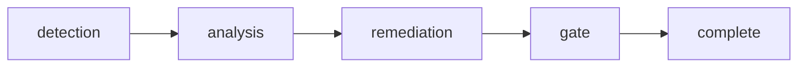

# Rite: slop-chop

> AI code quality gate — hallucination detection and temporal debt audit.

The slop-chop rite provides workflows for identifying and remediating AI-generated code quality issues: hallucinated APIs, temporal assumptions, logic gaps, and cruft patterns.

---

## Overview

| Property | Value |
|----------|-------|
| **Name** | slop-chop |
| **Form** | Full (multi-agent workflow) |
| **Agents** | 6 |
| **Entry Agent** | potnia |

---

## When to Use

- Auditing AI-generated code for hallucinated APIs or imports
- Detecting temporal assumptions (hardcoded dates, stale version references)
- Finding logic gaps and incomplete error handling
- Cleaning up AI code cruft patterns
- Quality-gating before merge of AI-authored PRs

---

## Agents

| Agent | Role |
|-------|------|
| **potnia** | Coordinates slop-chop assessment phases |
| **hallucination-hunter** | Detects hallucinated APIs, imports, and non-existent references |
| **logic-surgeon** | Identifies logic gaps, incomplete branches, and reasoning errors |
| **cruft-cutter** | Finds and removes unnecessary code patterns (dead code, redundant checks) |
| **gate-keeper** | Final quality gate — pass/fail decision with evidence |
| **remedy-smith** | Produces remediation patches for identified issues |

See agent files: `rites/slop-chop/agents/`

---

## Workflow Phases



| Phase | Agent | Produces | Condition |
|-------|-------|----------|-----------|
| detection | hallucination-hunter | Hallucination Report | Always |
| analysis | logic-surgeon + cruft-cutter | Analysis Report | Always |
| remediation | remedy-smith | Remediation Patches | If issues found |
| gate | gate-keeper | Pass/Fail Decision | Always |

---

## Invocation Patterns

```bash
# Quick switch to slop-chop
/slop-chop

# Hunt for hallucinated APIs
Task(hallucination-hunter, "scan src/ for non-existent API calls and imports")

# Analyze logic gaps
Task(logic-surgeon, "check error handling completeness in auth module")

# Run full quality gate
Task(gate-keeper, "quality gate assessment for PR #42")
```

---

## Source

**Manifest**: `rites/slop-chop/manifest.yaml`

---

## See Also

- [CLI: rite](../operations/cli-reference/cli-rite.md)
- [hygiene](hygiene.md) — Related: code quality (different focus — patterns vs AI artifacts)
- [Knossos Doctrine - Rites](../philosophy/knossos-doctrine.md#iv-the-rites)
