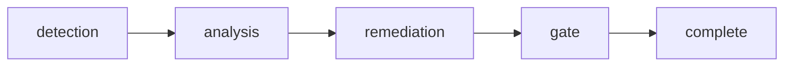

# Rite: slop-chop

> AI code quality gate — hallucination detection and temporal debt audit.

The slop-chop rite hunts for AI-generated code pathologies that standard code review misses — hallucinated imports, phantom API calls, cargo-culted patterns, and temporal debt (hardcoded dates, stale version assumptions). It treats AI-generated code as guilty until proven innocent. Hallucination-hunter performs static verification first: every import resolved, every API call cross-referenced against actual signatures, every dependency confirmed to exist. Logic-surgeon and cruft-cutter then assess reasoning quality and unnecessary patterns. Gate-keeper issues a binary verdict — PASS, FAIL, or CONDITIONAL-PASS — with an evidence chain, not a list of suggestions. FAIL blocks the merge. Temporal findings never block (they are always advisory) — this distinction prevents false positives while maintaining hard gates on hallucinated or broken code.

---

## Overview

| Property | Value |
|----------|-------|
| **Name** | slop-chop |
| **Form** | Full (multi-agent workflow) |
| **Agents** | 6 |
| **Entry Agent** | potnia |

---

## When to Use

- Quality-gating a PR where AI wrote significant portions of the code before it merges
- Auditing an existing codebase that was heavily AI-assisted for phantom imports or wrong API signatures
- Detecting temporal debt: hardcoded dates, deprecated API references, or version assumptions baked in at generation time
- Getting a binary PASS/FAIL gate verdict with full evidence chain, not a review checklist
- **Not for**: general code quality cleanup — use hygiene for that. Not for detecting architectural patterns or design issues — slop-chop targets the specific failure modes of LLM code generation, not human code quality.

---

## Agents

| Agent | Role |
|-------|------|
| **potnia** | Coordinates slop-chop assessment phases; routes to remedy-smith only when blocking findings are present |
| **hallucination-hunter** | Verifies every import, API call, and dependency against actual existence — static verification only, no logic assessment; produces detection-report |
| **logic-surgeon** | Identifies incomplete branches, missing error handling, and reasoning errors that hallucination-hunter's static pass cannot catch |
| **cruft-cutter** | Finds AI-characteristic cruft: dead code generated "just in case," redundant null checks, copy-pasted boilerplate without adaptation |
| **gate-keeper** | Issues PASS / FAIL / CONDITIONAL-PASS verdict with complete evidence chain; FAIL exits non-zero and blocks merge; temporal findings are always advisory |
| **remedy-smith** | Produces targeted remediation patches for blocking findings — invoked only when gate-keeper finds issues that need fixing |

See agent files: `rites/slop-chop/agents/`

---

## Workflow Phases



| Phase | Agent | Produces | Condition |
|-------|-------|----------|-----------|
| detection | hallucination-hunter | Hallucination Report | Always |
| analysis | logic-surgeon + cruft-cutter | Analysis Report | Always |
| remediation | remedy-smith | Remediation Patches | If issues found |
| gate | gate-keeper | Pass/Fail Decision | Always |

---

## Invocation Patterns

```bash
# Quick switch to slop-chop
/slop-chop

# Full quality gate for an AI-authored PR
Task(hallucination-hunter, "verify all imports and API calls in src/auth/ against actual existence — produce detection-report")

# Logic assessment after hallucination check is clean
Task(logic-surgeon, "check error handling completeness and branch coverage in the auth module — look for AI reasoning gaps")

# Issue the final gate verdict
Task(gate-keeper, "synthesize all findings from detection-report and analysis-report — issue PASS/FAIL for PR #42")
```

---

## Source

**Manifest**: `rites/slop-chop/manifest.yaml`

---

## See Also

- [CLI: rite](../operations/cli-reference/cli-rite.md)
- [hygiene](hygiene.md) — Related: code quality (different focus — patterns vs AI artifacts)
- [Knossos Doctrine - Rites](../philosophy/knossos-doctrine.md#iv-the-rites)
