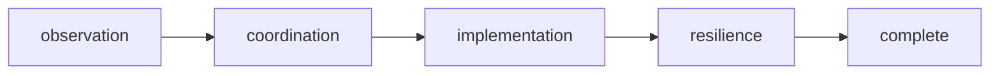

# Rite: sre

> Reliability engineering lifecycle for observability, coordination, and resilience testing.

The SRE rite builds production reliability from the ground up: make the system observable, create runbooks for what can fail, harden the infrastructure, then deliberately break it to verify the hardening worked. Observability-engineer does not just add metrics — it maps the Four Golden Signals coverage, defines SLI/SLO targets with error budgets, and tunes alerts for signal-not-noise. Incident-commander produces runbooks before incidents happen, not postmortems after. Chaos-engineer is the rite's verification mechanism: every resilience claim gets a controlled fault injection experiment with an explicit blast radius limit and abort criteria. A claim without a chaos experiment is a hypothesis, not a guarantee.

---

## Overview

| Property | Value |
|----------|-------|
| **Name** | sre |
| **Form** | Full (multi-agent workflow) |
| **Agents** | 5 |
| **Entry Agent** | potnia |

---

## When to Use

- Evaluating observability coverage for a service launching without monitoring
- Defining SLI/SLO targets with error budgets and burn rate alerting before a reliability commitment
- Creating incident runbooks for known failure modes before they become incidents
- Hardening infrastructure against dependency outages, network partitions, or resource exhaustion
- Verifying resilience claims with controlled chaos experiments — not just asserting that failover works
- **Not for**: active incident response in progress — the rite is proactive. Not for diagnosing production bugs — use clinic. SRE prepares for failure; clinic responds to it.

---

## Agents

| Agent | Role |
|-------|------|
| **potnia** | Coordinates reliability engineering phases; gates chaos experiments on completed infrastructure hardening |
| **observability-engineer** | Maps Four Golden Signals coverage, defines SLI/SLO targets with error budgets, designs dashboards for signal-not-noise alerting |
| **incident-commander** | Produces incident runbooks for known failure scenarios — step-by-step procedures, escalation paths, rollback instructions |
| **platform-engineer** | Implements infrastructure changes (failover, circuit breakers, rate limiting) against the reliability plan |
| **chaos-engineer** | Designs fault injection experiments with explicit hypotheses, blast radius limits, and abort criteria — breaks production on purpose to verify claims |

See agent files: `rites/sre/agents/`

---

## Workflow Phases



| Phase | Agent | Produces | Condition |
|-------|-------|----------|-----------|
| observation | observability-engineer | Observability Report | Always |
| coordination | incident-commander | Reliability Plan | complexity >= SERVICE |
| implementation | platform-engineer | Infrastructure Changes | Always |
| resilience | chaos-engineer | Resilience Report | Always |

---

## Invocation Patterns

```bash
# Quick switch to SRE
/sre

# Full observability coverage for a new service
Task(observability-engineer, "audit payment service monitoring — map Four Golden Signals coverage, define SLI/SLOs with error budgets")

# Create runbooks for known failure modes
Task(incident-commander, "create incident runbook for database primary failover — include step-by-step procedures, escalation path, and rollback")

# Verify resilience claims with controlled fault injection
Task(chaos-engineer, "design chaos experiment for database failover claim — define hypothesis, blast radius, abort criteria, then execute")
```

---

## Skills

- `doc-sre` — SRE documentation
- `sre-ref` — Workflow reference

---

## Source

**Manifest**: `rites/sre/manifest.yaml`

---

## See Also

- [CLI: rite](../operations/cli-reference/cli-rite.md)
