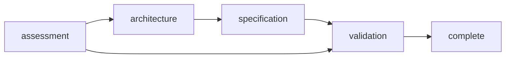

# Rite: thermia

> Cache architecture consultation lifecycle.

The thermia rite is a cache architecture consultation engine. It does not assume caching is the answer — it starts by mapping hot paths, exhausting alternatives (query optimization, materialized views, connection pooling, CDN, denormalization), and only designing a cache architecture for paths that genuinely need one. Every sizing number has a derivation. Every architecture decision has an explicit failure mode.

---

## Overview

| Property | Value |
|----------|-------|
| **Name** | thermia |
| **Form** | Full (multi-agent workflow) |
| **Agents** | 5 |
| **Entry Agent** | potnia |

---

## When to Use

- Deciding whether a system needs caching (or something else)
- Designing a new cache layer from scratch
- Reviewing an existing cache for anti-patterns
- Investigating cache-related performance problems
- Planning cache capacity and eviction policy

---

## Agents

| Agent | Role |
|-------|------|
| **potnia** | Coordinates cache consultation phases, gates complexity, manages consultative flow |
| **heat-mapper** | Maps hot paths, evaluates alternatives using the 6-gate framework, produces CACHE/OPTIMIZE-INSTEAD/DEFER verdicts |
| **systems-thermodynamicist** | Selects cache patterns, consistency models, failure modes, and hierarchy design |
| **capacity-engineer** | Sizes caches via working set analysis, selects eviction policies, designs stampede protection and TTL strategy |
| **thermal-monitor** | Designs observability, alerting thresholds, operational runbooks, and validates the full architecture |

See agent files: `rites/thermia/agents/`

---

## Workflow Phases



| Phase | Agent | Produces | Condition |
|-------|-------|----------|-----------|
| assessment | heat-mapper | thermal-assessment.md | Always |
| architecture | systems-thermodynamicist | cache-architecture.md | complexity >= STANDARD |
| specification | capacity-engineer | capacity-specification.md | complexity >= STANDARD |
| validation | thermal-monitor | observability-plan.md | Always |

### Complexity Levels

| Level | Scope | Phases |
|-------|-------|--------|
| **QUICK** | Single caching question or yes/no triage | assessment → validation |
| **STANDARD** | New cache design or existing cache review | All 4 phases |
| **DEEP** | Post-mortem, production crisis, or full system redesign | All 4 phases at extended depth |

---

## Invocation Patterns

```bash
# Quick switch to thermia
/thermia

# Assess whether caching is warranted
Task(heat-mapper, "product API has high latency — user wants Redis. Assess whether caching is the right solution.")

# Design cache architecture (after assessment)
Task(systems-thermodynamicist, "two CACHE-verdicted layers: session store (zero staleness) and product catalog (5-min staleness ok)")

# Size cache capacity
Task(capacity-engineer, "size product catalog cache: 50K SKUs, avg 2KB per entry, 800 req/s reads")

# Design observability
Task(thermal-monitor, "design observability plan for the full cache architecture")
```

---

## Skills

- `thermia-ref` — Cache architecture workflow reference

---

## Source

**Manifest**: `rites/thermia/manifest.yaml`

---

## See Also

- [CLI: rite](../operations/cli-reference/cli-rite.md)
- [CLI: sync](../operations/cli-reference/cli-sync.md)
- [Rite Catalog](index.md)
